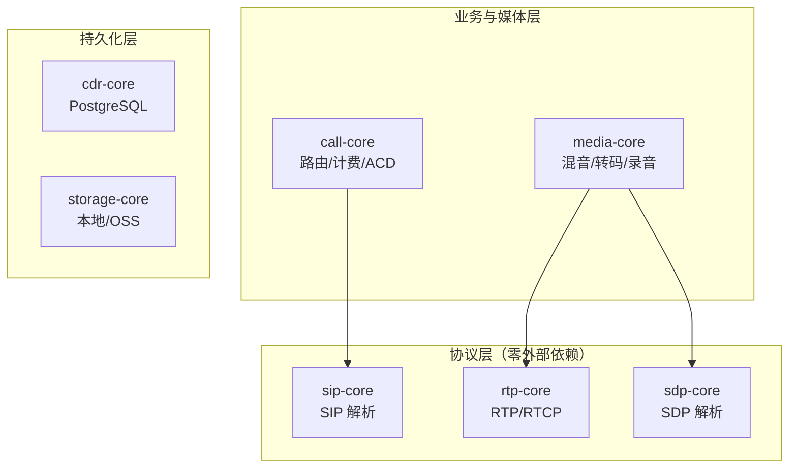

# crates — vos-rs 协议库与业务核心库

> **vos-rs 的 Rust workspace 共享 crate 集合** — 协议解析、业务逻辑、数据持久化的可复用基础层

## 这是什么？

`crates/` 是 vos-rs 项目的 **Rust workspace 共享 crate 集合**。这些 crate 把「与运行时服务无关的能力」抽离出来，作为可复用的基础库，被 `services/` 下的三个二进制服务（`sip-edge` / `api-server` / `cdr-worker`）共同依赖。

打个比方：如果 `services/` 是汽车的「发动机 + 底盘 + 电气系统」，那 `crates/` 就是更底层的「钢材 + 螺丝 + 轴承」——可以单独拿出来用在别的车上。

## 为什么拆成独立 crate？

| 优势 | 说明 |
| :--- | :--- |
| **独立编译** | 协议层 crate 可以单独 `cargo build -p sip-core`，便于调试和单元测试 |
| **零外部依赖** | `sip-core` / `rtp-core` / `sdp-core` 零外部依赖，可被其他 VoIP 项目直接复用 |
| **编译期检查** | sqlx 编译期 SQL 校验集中在 `cdr-core`，错误提前暴露 |
| **职责单一** | 每个 crate 只管一件事，便于维护和重构 |
| **并行编译** | cargo 自动并行编译无依赖关系的 crate，加快全量构建 |

## Crate 清单

| Crate | 类型 | 一句话定位 | 依赖关系 |
| :--- | :--- | :--- | :--- |
| [`sip-core`](./sip-core/) | 协议库 | SIP 协议解析（零外部依赖） | 无 |
| [`rtp-core`](./rtp-core/) | 协议库 | RTP/RTCP 协议实现（零外部依赖） | 无 |
| [`sdp-core`](./sdp-core/) | 协议库 | SDP 协议解析（零外部依赖） | 无 |
| [`call-core`](./call-core/) | 业务库 | 呼叫控制 + 路由 + 计费 + ACD | `sip-core` |
| [`media-core`](./media-core/) | 媒体库 | 媒体面算法（混音/转码/录音/DTMF/质量监控） | `rtp-core`、`sdp-core` |
| [`cdr-core`](./cdr-core/) | 数据库 | PostgreSQL 持久化 + schema 迁移 | 无（sqlx） |
| [`storage-core`](./storage-core/) | 存储抽象 | 录音文件本地/OSS/双写存储 | 无（async_trait） |

## 依赖关系图

```text
┌──────────────────────────────────────────────────────────┐
│                    services/ 二进制服务                    │
│  ┌──────────┐  ┌──────────┐  ┌──────────┐                │
│  │ sip-edge │  │api-server│  │cdr-worker│                │
│  └────┬─────┘  └────┬─────┘  └────┬─────┘                │
└───────┼─────────────┼─────────────┼──────────────────────┘
        │             │             │
        ▼             ▼             ▼
┌──────────────────────────────────────────────────────────┐
│                      crates/ 共享库                       │
│                                                          │
│  ┌──────────┐     ┌──────────┐                           │
│  │ sip-core │◄────│call-core │  ← 业务逻辑层              │
│  └──────────┘     └────┬─────┘                           │
│                        │                                 │
│  ┌──────────┐     ┌────▼─────┐  ← 数据持久化层           │
│  │ rtp-core │     │ cdr-core │                           │
│  └──────────┘     └──────────┘                           │
│                                                          │
│  ┌──────────┐     ┌──────────────┐                       │
│  │ sdp-core │     │ storage-core │  ← 文件存储抽象       │
│  └──────────┘     └──────────────┘                       │
│                                                          │
│  注: sip-core / rtp-core / sdp-core / cdr-core /         │
│       storage-core 均无相互依赖, 可独立使用               │
└──────────────────────────────────────────────────────────┘
```

### 7 个 crate 依赖关系（mermaid）

下图补充展示含 `media-core` 的 7 个 crate 依赖关系：协议层零依赖，业务/媒体层依赖协议层，持久化层独立。



## 分层职责

### 1. 协议层（零外部依赖，纯 Rust）

| Crate | 职责 |
| :--- | :--- |
| `sip-core` | SIP 信令解析（RFC 3261），含零拷贝版本 |
| `rtp-core` | RTP/RTCP 媒体传输，含 G.711 编解码 + DTMF + SRTP |
| `sdp-core` | SDP 媒体协商，含 ICE/DTLS-SRTP 参数 |

**特点**：这三个 crate **零外部依赖**，可以单独拿出来用在任何 Rust VoIP 项目中。

### 2. 业务层

| Crate | 职责 |
| :--- | :--- |
| `call-core` | 呼叫状态机 + 路由引擎 + 实时计费 + ACD 队列 + CDR 生成 |

**特点**：依赖 `sip-core`（用到 SIP 方法/URI 类型），但**不依赖**任何 I/O 或数据库——纯业务逻辑，便于单元测试 mock。

### 3. 媒体层

| Crate | 职责 |
| :--- | :--- |
| `media-core` | 混音 / 转码 / 录音 / DTMF / 质量监控（MOS） |

**特点**：依赖 `rtp-core` 与 `sdp-core`，自身不做网络 I/O，只提供媒体算法，供 `sip-edge` 与未来 `media-edge` 共享。

### 4. 持久化层

| Crate | 职责 |
| :--- | :--- |
| `cdr-core` | PostgreSQL CRUD + schema 自动迁移（21 张表） |
| `storage-core` | 文件存储抽象（本地 FS / 阿里云 OSS / 双写） |

**特点**：
- `cdr-core` 用 sqlx 编译期 SQL 检查，启动时自动建表/补字段
- `storage-core` 提供 `StorageBackend` trait，上层无需关心存储介质

## 各服务对 crate 的依赖关系

```text
sip-edge (B2BUA + 媒体中继)
├── sip-core      ← SIP 消息解析
├── rtp-core      ← RTP 收发 + DTMF + 录音
├── sdp-core      ← SDP 协商 + NAT 改写
├── call-core     ← 路由 + 计费 + ACD
├── media-core    ← 混音/转码/录音算法
├── cdr-core      ← 配置查询 + CDR 写入
└── storage-core  ← 录音文件存储

api-server (REST API + Web 控制台后端)
└── cdr-core      ← 所有 CRUD 操作

cdr-worker (NATS CDR 消费者)
└── cdr-core      ← 批量 CDR 落库
```

## 编译与测试

### 全量编译

```bash
cargo build --workspace          # 开发构建
cargo build --workspace --release  # 生产构建
```

### 单 crate 编译

```bash
cargo build -p sip-core          # 只编译 SIP 协议库
cargo build -p cdr-core          # 只编译数据存储层
```

### 类型检查 + Lint

```bash
cargo check --workspace          # 类型检查
cargo clippy --workspace -- -D warnings  # Lint (零 warning)
```

### 测试

```bash
cargo test --workspace           # 全量测试
cargo test -p sip-core           # 单 crate 测试
cargo test -p call-core --test routing_manager  # 单测试文件
```

### 性能基准

```bash
cargo bench -p call-core         # 路由引擎并发基准
```

## 设计原则

### 1. 协议层零依赖

`sip-core` / `rtp-core` / `sdp-core` 不依赖任何外部 crate（甚至不依赖 tokio），保证：
- 可被任何 Rust 项目复用
- 编译速度快
- 无版本冲突风险

### 2. 业务层无 I/O

`call-core` 只做业务决策，不做网络/数据库 I/O。所有外部依赖通过 trait 注入，便于单元测试 mock。

### 3. 持久化层在线迁移

`cdr-core` 使用 `ALTER TABLE ... ADD COLUMN IF NOT EXISTS` 渐进式迁移，无需停服升级，旧库自动补字段。

### 4. 错误处理分层

- 协议层：`thiserror` 定义具体错误枚举
- 业务层：`thiserror` + `Result` 传播
- 应用层（services）：`anyhow` 聚合错误上下文

### 5. 命名约定

- crate 名：`kebab-case`（如 `sip-core`）
- 模块名：`snake_case`（如 `buffer_pool`）
- 公共 API 必须有 `///` 文档注释
- 禁止 `unwrap()` / `expect()` 出现在生产代码

## 添加新 crate

如果要新增一个 crate（例如 `media-codec`），步骤：

1. 在 `crates/` 下创建目录：`crates/media-codec/`
2. 创建 `Cargo.toml`：

```toml
[package]
name = "media-codec"
version = "0.1.0"
edition = "2021"

[dependencies]
```

3. 在根 `Cargo.toml` 的 `[workspace] members` 中注册：

```toml
members = [
    "crates/sip-core",
    # ...
    "crates/media-codec",  # 新增
]
```

4. 创建 `src/lib.rs` 并编写代码
5. 创建 `README.md` 说明定位和能力
6. `cargo build -p media-codec` 验证编译

## 相关文档

- 项目根 README：[../../README.md](../README.md)
- 架构分析：[../../docs/architecture/VOS_RS_ARCHITECTURE_ANALYSIS.md](../docs/architecture/VOS_RS_ARCHITECTURE_ANALYSIS.md)
- 编码规范：[../../AGENTS.md](../AGENTS.md)
- 各 crate 详细文档：见各 crate 目录下的 `README.md`
