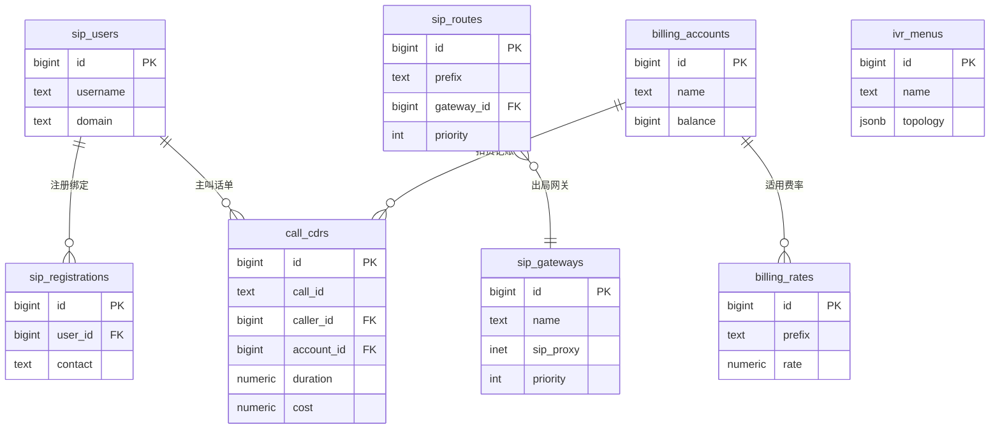

# cdr-core

> **数据存储层** — 把通话记录、配置、计费账本持久化到 PostgreSQL

## 这是什么？

`cdr-core` 是 vos-rs 平台的 **数据持久化层**。所有需要落库的东西都走这个 crate：
- 通话详单（CDR）
- 网关 / 路由 / 用户 / 号码 配置
- 计费账户 / 流水 / 费率
- 反欺诈规则
- SIP 注册绑定
- 网关健康状态

它还负责**数据库 schema 自动迁移**——服务启动时自动建表、补字段，无需手动执行 SQL。

## 核心能力

| 能力 | 说明 |
| :--- | :--- |
| **CDR 批量写入** | PostgreSQL UNNEST 批量插入，单次 1000 条 |
| **CRUD 仓储** | 网关/路由/用户/号码/费率/账户/反欺诈规则 |
| **实时计费** | 事务保证余额扣减 + 流水记录原子性 |
| **在线迁移** | `ALTER TABLE ... ADD COLUMN IF NOT EXISTS`，无需停服 |
| **JSONB 拓扑** | IVR/路由的可视化画布拓扑存为 JSONB |
| **PostgreSQL 连接池** | sqlx PgPool，编译期 SQL 检查 |

## 数据库表

| 表名 | 用途 |
| :--- | :--- |
| `call_cdrs` | 通话详单 |
| `sip_gateways` | 网关配置 |
| `sip_routes` | 路由规则（含 topology JSONB） |
| `sip_users` | SIP 用户 |
| `sip_registrations` | 注册绑定 |
| `billing_rates` | 费率表 |
| `billing_accounts` | 计费账户 |
| `billing_ledger` | 扣费流水 |
| `gateway_health_status` | 网关健康状态 |
| `anti_fraud_rules` | 反欺诈规则 |
| `dtmf_events` | DTMF 事件 |
| `number_inventory` | 号码库存 |
| `ivr_menus` | IVR 菜单（含 nodes/edges JSONB） |
| `ivr_actions` | IVR 按键映射 |
| `call_queues` | 呼叫队列 |
| `call_agents` | 座席 |
| `trunk_ip_rules` | 中继 IP 规则 |
| `egress_endpoints` | 出局端点 |
| `caller_pools` | 主叫号码池 |
| `extension_groups` | 分机组 |
| `did_destinations` | DID 目的地 |

## 架构图

### 核心表关系（ER 图）

下图展示 8 张核心表的关联：用户与注册绑定、路由指向网关、账户关联费率并为话单扣费、IVR 菜单独立存储拓扑。



## 在项目中的位置

```
sip-edge / api-server / cdr-worker ──→ cdr-core ──→ PostgreSQL
```

三个服务都依赖 `cdr-core`：
- `sip-edge`：通话结束写 CDR、查询路由/网关配置
- `api-server`：Web 控制台的 CRUD 操作
- `cdr-worker`：从 NATS 消费 CDR 事件批量落库

## 模块结构

| 模块 | 职责 |
| :--- | :--- |
| `lib.rs` | `PostgresCdrStore` 入口 + 迁移逻辑 |
| `models.rs` | 数据模型（`SipRoute` / `SipGateway` / `SipUser` 等） |
| `schema.rs` | 数据库 CREATE TABLE + 迁移 SQL |
| `store/` | 各业务仓储实现（`route.rs` / `gateway.rs` / `user.rs` 等） |
| `termination_schema.rs` | 终结域 schema（IVR / 队列 / 号码池等） |
| `termination_models.rs` | 终结域模型 |

## 使用示例

```rust
use cdr_core::PostgresCdrStore;

let store = PostgresCdrStore::new(&database_url).await?;

// 自动迁移（建表/补字段）
store.run_migrations().await?;

// 查询路由
let routes = store.list_routes_full().await?;

// 写入 CDR
store.insert_cdr(&cdr).await?;
```

## 测试

```bash
cargo test -p cdr-core
```

集成测试需要 PostgreSQL（通过 docker-compose 启动）。
