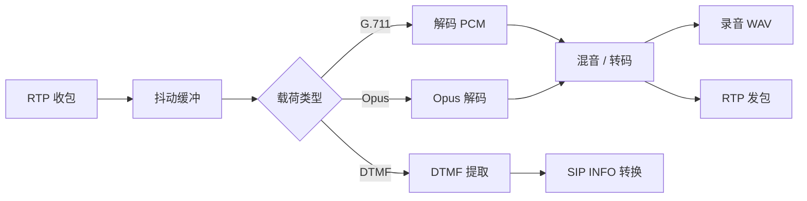
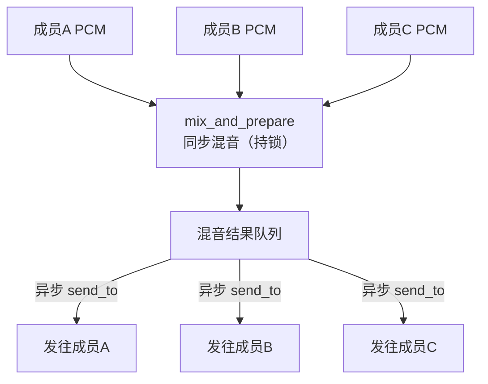
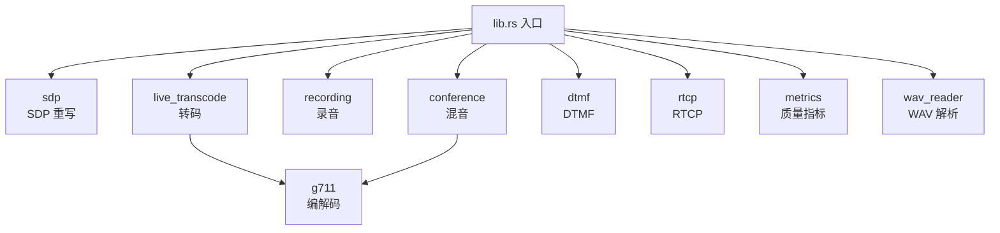

# media-core

> **媒体面核心算法库** — RTP 收发、混音、转码、录音、DTMF、质量监控的统一底座

## 这是什么？

`media-core` 是 vos-rs 平台的 **媒体处理核心库**。它把「与具体网络 I/O 无关、但与媒体流强相关」的算法集中起来，为信令边缘节点（`sip-edge`）和独立媒体边缘节点（`media-edge`）提供底层媒体包处理、转码、混音、录音及 SDP 重写支持。

打个比方：`rtp-core` 负责把 RTP 字节流拆成结构体，`media-core` 负责拿这些结构体去解码、混音、转码、录音、估算通话质量。它是媒体面的「算法工具箱」。

## 核心能力

| 能力 | 说明 |
| :--- | :--- |
| **SDP 快速重写** | 仅改写媒体连接地址 / 端口映射，避免完整 SDP 解析开销；支持媒体级 `c=` 覆盖会话级 |
| **多方混音** | 同步 `mix_and_prepare` + 异步 `send_to` 解耦，避免持锁跨 `.await`，降低高并发丢包 |
| **实时转码** | G.711 (PCMA/PCMU) ↔ linear PCM，8kHz 与 16kHz/48kHz 动态重采样 |
| **高可靠录音** | 标准 WAV (PCM 16-bit)，I/O 错误经原子变量透传，支持分片轮转 |
| **DTMF** | RFC 2833 / Telephone-Event 带内提取与合成，并提供到 SIP INFO 的带外转换 |
| **质量监控** | 抖动 (Jitter) / 丢包率估算 + 实时 MOS 分，写入 CDR |
| **静音 / 旁路** | 会议成员级静音、旁路控制 |
| **零 panic** | 全路径 `Result` 错误处理，生产路径禁止 `unwrap` |

### 协商策略

`AUDIO_ONLY` 策略在 SDP 协商阶段主动拒绝 T.38 传真等非音频提议，确保只有音频媒体流进入混音 / 转码流水线；遇到不支持的编码时按优先级回退到 G.711，保证通话可接通。

## 架构图

### 媒体处理流水线

一帧 RTP 到达后的处理路径：抖动缓冲 → 按载荷类型分流 → 解码 → 混音 / 转码 → 录音与发送。



### 会议混音架构

混音在持锁阶段同步完成（`mix_and_prepare`），随后释放锁，由外部异步 `send_to` 把结果发往各成员，杜绝跨 `.await` 持锁。



### 模块关系



## 在项目中的位置

```
rtp-core (RTP 包) ──→ media-core (解码/混音/转码/录音) ──→ sip-edge / media-edge
sdp-core (SDP)     ──→ media-core (SDP 快速重写)
```

`media-core` 依赖 `rtp-core` 与 `sdp-core`，但自身不直接做网络 I/O，只提供算法与数据结构，便于在 `sip-edge` 进程内或独立 `media-edge` 服务中复用。

把媒体算法从 `sip-edge/src/media.rs` 抽离为独立 crate 有两个动机：一是让信令节点与媒体节点共享同一套混音 / 转码 / 录音实现，避免双份代码；二是让 CPU 密集的媒体算法可单独编译、单独测试、单独做性能基准，不被信令事务逻辑干扰。

## 模块结构

| 模块 | 职责 |
| :--- | :--- |
| `sdp` | SDP 快速重写、媒体级覆盖、协商策略（如 `AUDIO_ONLY` 拒绝 T.38） |
| `conference` | 多方混音引擎、静音 / 旁路控制 |
| `recording` | WAV 录音、I/O 错误反馈、分片轮转 |
| `live_transcode` | `LiveTranscoder` 实时转码、动态重采样 |
| `dtmf` | RFC 2833 DTMF 提取与生成、带外转换 |
| `rtcp` | RTCP 报告、抖动 / 丢包估算 |
| `metrics` | MOS 分估算、接收质量统计 |
| `g711` | PCMU / PCMA 查表编解码、原地点对点转码 |
| `crypto` | 媒体加密辅助 |
| `energy` | 语音能量检测（VAD） |
| `wav_reader` | WAV 文件解析（彩铃 / IVR 提示音） |
| `config` | 媒体配置 |
| `time` | 媒体时间戳工具 |

## 使用示例

```rust
use media_core::g711;
use media_core::live_transcode::{LiveTranscoder, AudioCodec};

// 1. G.711 编码：线性 PCM 样本 → μ-law 字节
let pcm_sample: i16 = 1000;
let mulaw_byte: u8 = g711::linear_to_ulaw(pcm_sample);

// 2. PCMA ↔ PCMU 原地转码（不分配新缓冲区）
let mut payload = vec![0u8; 160];
g711::transcode_pcma_to_pcmu_inplace(&mut payload);

// 3. 实时转码器：本端 PCMU ↔ 对端 PCMA
let mut transcoder = LiveTranscoder::new(AudioCodec::Pcmu, AudioCodec::Pcma)?;
let out = transcoder.transcode(&payload)?;
```

### 会议混音（概念流程）

混音涉及多成员状态，不直接出现在上面的单点示例中。典型流程如下：

1. 为每个参会成员维护一路 PCM 输入队列；
2. 周期性调用 `mix_and_prepare`，把各成员当前帧混成一路 G.711 输出（持锁，同步）；
3. 释放会议锁后，用异步 `send_to` 把混音结果回送到每个成员的 RTP 端口；
4. 任一成员可被标记为静音（不参与混音）或旁路（只收不发）。

## 设计哲学

1. **高性能与低延迟**：媒体处理是 CPU 密集型任务，算法最大化减少堆内存分配，采用预分配缓冲区。
2. **高并发锁安全**：细粒度并发设计，遵循 vos-rs 规范，严禁跨越 `.await` 边界持有 `std::sync::Mutex`，确保高负载下通话媒体流不抖动 / 不静音。
3. **零 panic 安全性**：作为电信级平台核心库，所有操作均返回 `Result`，严禁生产路径 `unwrap` 或 panic。
4. **无 I/O 抽象**：网络收发由上层（`sip-edge` / `media-edge`）负责，本 crate 只处理字节与样本，单测时无需真实 socket。

## 测试

```bash
cargo test -p media-core
```

含 `tests/sdp.rs` SDP 重写集成测试，及各模块单元测试（混音、转码、DTMF、质量指标）。
