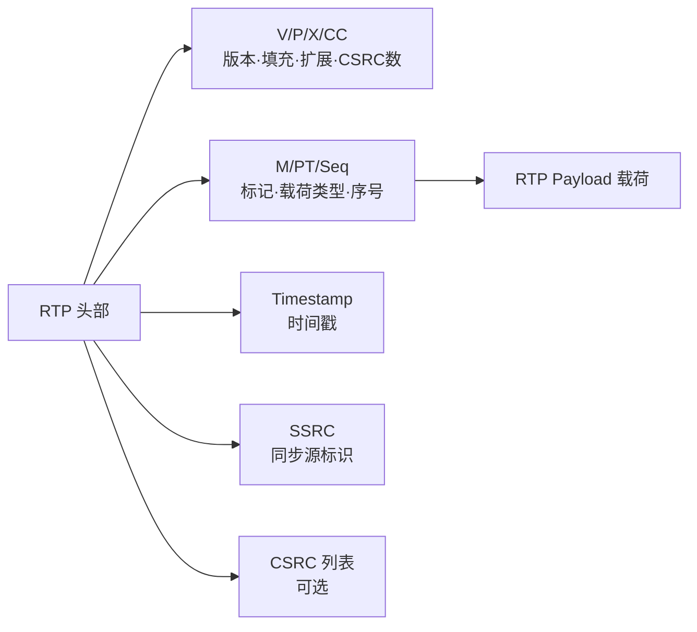
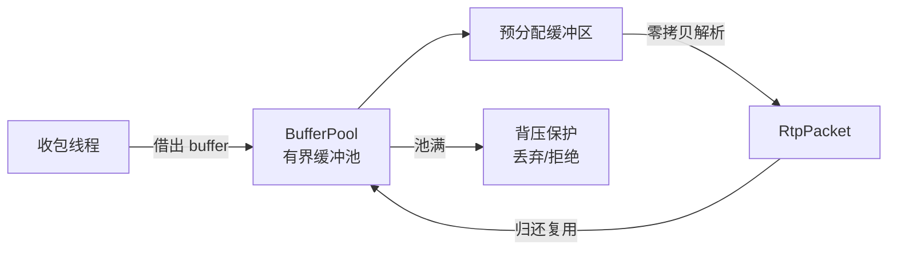

# rtp-core

> **RTP/RTCP 协议实现** — VoIP 语音数据的传输与质量监控

## 这是什么？

`rtp-core` 是 vos-rs 平台的 **媒体传输协议层**。如果说 `sip-core` 负责「电话怎么呼叫」，那 `rtp-core` 负责「通话过程中的语音数据怎么传输」。

RTP（Real-time Transport Protocol）承载实际的语音流，RTCP（RTP Control Protocol）负责通话质量监控（丢包率、抖动、延迟）。

## 核心能力

| 能力 | 说明 |
| :--- | :--- |
| **RTP 包解析** | 零拷贝解析 RTP 头部和载荷，支持 CSRC 列表、扩展头 |
| **RTCP 报告** | Sender Report / Receiver Report 解析与生成 |
| **G.711 编解码** | PCMU（μ-law）和 PCMA（A-law）查表法 $O(1)$ |
| **DTMF 事件** | RFC 2833 Telephone Event 带内按键检测 |
| **SRTP 加密** | AES-128-CM 模式，保障通话内容安全 |
| **BufferPool** | 有界缓冲池，避免热路径堆分配 |

## RTP 包格式

```text
 0                   1                   2                   3
 0 1 2 3 4 5 6 7 8 9 0 1 2 3 4 5 6 7 8 9 0 1 2 3 4 5 6 7 8 9 0 1
+-+-+-+-+-+-+-+-+-+-+-+-+-+-+-+-+-+-+-+-+-+-+-+-+-+-+-+-+-+-+-+-+
|V=2|P|X|  CC   |M|     PT      |       sequence number         |
+-+-+-+-+-+-+-+-+-+-+-+-+-+-+-+-+-+-+-+-+-+-+-+-+-+-+-+-+-+-+-+-+
|                           timestamp                           |
+-+-+-+-+-+-+-+-+-+-+-+-+-+-+-+-+-+-+-+-+-+-+-+-+-+-+-+-+-+-+-+-+
|           synchronization source (SSRC) identifier            |
+-+-+-+-+-+-+-+-+-+-+-+-+-+-+-+-+-+-+-+-+-+-+-+-+-+-+-+-+-+-+-+-+
|            contributing source (CSRC) identifiers             |
+-+-+-+-+-+-+-+-+-+-+-+-+-+-+-+-+-+-+-+-+-+-+-+-+-+-+-+-+-+-+-+-+
```

## 架构图

### RTP 包结构



### BufferPool 工作机制

收发热路径通过有界缓冲池复用预分配内存，避免每包 `Vec` 分配，池满时触发背压保护。



## 在项目中的位置

```
sip-core (信令) ──┐
                   ├─→ sip-edge/media.rs (RTP Relay + 录音)
rtp-core (媒体) ──┘
```

`sip-edge` 的 `media.rs` 模块使用 `rtp-core` 收发 RTP 包、检测 DTMF、转码、录音。

## 模块结构

| 模块 | 职责 |
| :--- | :--- |
| `packet` | RTP 包结构、解析、序列化 |
| `payload` | 载荷类型枚举（PCMU/PCMA/Opus 等） |
| `rtcp` | RTCP 报告解析与生成 |
| `telephone_event` | RFC 2833 DTMF |
| `srtp` | SRTP 加解密 |
| `buffer_pool` | 有界缓冲池（热路径优化） |
| `port_lease` | RTP 端口租约管理 |

## 使用示例

```rust
use rtp_core::{RtpPacket, PayloadType};

// 解析收到的 RTP 包
let packet: RtpPacket = RtpPacket::parse(&bytes)?;
println!("SSRC={} seq={} ts={} pt={:?}",
    packet.ssrc, packet.sequence, packet.timestamp, packet.payload_type);

// 生成 RTP 包发送
let pkt = RtpPacket::builder()
    .ssrc(0x12345678)
    .sequence(1)
    .timestamp(160)
    .payload_type(PayloadType::PCMU)
    .payload(&audio_frame)
    .build();
```

## 测试

```bash
cargo test -p rtp-core
```

覆盖率 > 90%，含 RFC 3550 标准测试向量、畸形包、边界条件。
