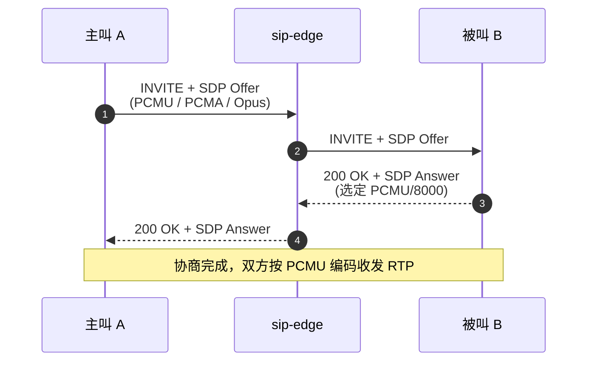

# sdp-core

> **SDP 协议解析** — 通话双方协商「用什么编码、在哪个端口收发语音」

## 这是什么？

`sdp-core` 是 vos-rs 平台的 **媒体协商协议层**。SDP（Session Description Protocol）用于 SIP 通话建立时协商媒体参数：双方用什么编码（G.711 / Opus）、RTP 端口、加密方式等。

打个比方：`sip-core` 负责打电话「喂你好」，`sdp-core` 负责商量「我们用普通话还是英语、用手机还是微信」。

## 核心能力

| 能力 | 说明 |
| :--- | :--- |
| **SDP 解析** | 解析 `v=`/`o=`/`c=`/`m=`/`a=` 全部字段 |
| **SDP 重写** | 修改 IP 地址和端口（SIP 代理 NAT 穿透用） |
| **音频格式** | PCMU / PCMA / Opus / Telephone-Event 编解码协商 |
| **ICE 候选** | WebRTC ICE 候选解析 |
| **DTLS-SRTP** | 加密参数提取 |

## SDP 结构示例

```text
v=0                          ← 版本
o=- 12345 2 IN IP4 1.2.3.4   ← 会话标识
s=call                       ← 会话名称
c=IN IP4 1.2.3.4             ← 连接信息（RTP 收发地址）
t=0 0                        ← 时间
m=audio 40000 RTP/AVP 0 8    ← 媒体描述（端口/协议/编码列表）
a=rtpmap:0 PCMU/8000         ← 编解码器映射
a=rtpmap:8 PCMA/8000
a=sendrecv                   ← 收发模式
```

## 架构图

### SDP Offer / Answer 协商时序

主叫在 INVITE 中携带 SDP Offer 列出支持的编码，被叫在 200 OK 中回 SDP Answer 选定编码，双方据此建立 RTP 流。



## 在项目中的位置

```
sip-core (SIP 消息体含 SDP) → sdp-core (解析 SDP) → sip-edge (媒体协商 + RTP 改写)
```

`sip-edge` 在 B2BUA 处理 INVITE 时，用 `sdp-core` 解析 SDP、改写地址端口、协商编解码器。

## 模块结构

| 模块 | 职责 |
| :--- | :--- |
| `session` | SDP 会话结构、解析、重写 |
| `error` | `SdpError` 错误类型 |

## 使用示例

```rust
use sdp_core::{parse_sdp, SdpSession};

let raw = b"v=0\r\no=- 12345 2 IN IP4 1.2.3.4\r\ns=call\r\nc=IN IP4 1.2.3.4\r\n
            t=0 0\r\nm=audio 40000 RTP/AVP 0 8\r\na=rtpmap:0 PCMU/8000\r\n";

let session: SdpSession = parse_sdp(raw)?;
println!("媒体地址: {}:{}", session.connection.address, session.media[0].port);
println!("支持的编码: {:?}", session.media[0].formats);
```

## 测试

```bash
cargo test -p sdp-core
```

覆盖率 > 90%，含 RFC 4566 标准用例、WebRTC SDP、畸形输入。
