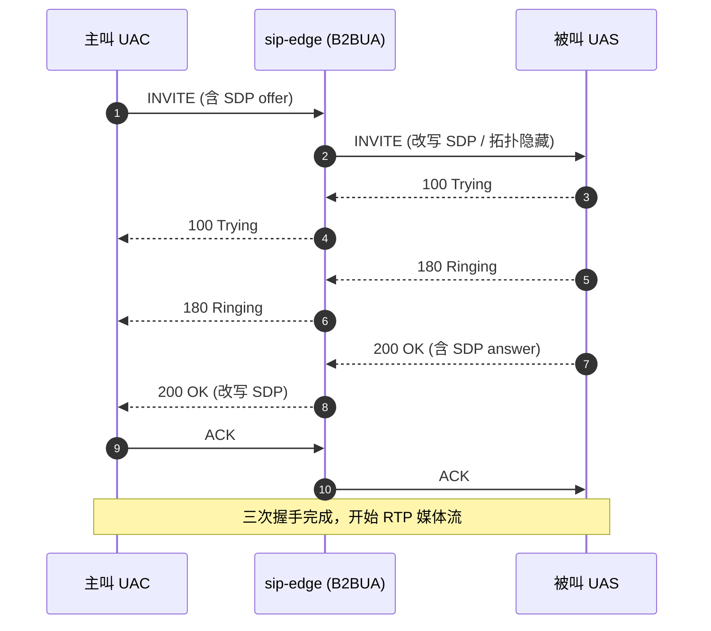

# sip-core

> **SIP 协议解析库** — 把文字格式的 SIP 消息拆解成 Rust 结构体

## 这是什么？

`sip-core` 是 vos-rs 平台的 **SIP 协议解析层**。SIP（Session Initiation Protocol）是 VoIP 通话的「信令协议」——电话怎么呼出、怎么接听、怎么挂断，都靠 SIP 消息来沟通。

本 crate 负责把网络上收到的 SIP 文本消息（如 `INVITE sip:1001@1.2.3.4 SIP/2.0\r\n...`）解析成 Rust 结构体，供上层 `sip-edge` 服务处理。

## 核心能力

| 能力 | 说明 |
| :--- | :--- |
| **SIP 消息解析** | RFC 3261 完整语法，支持 INVITE / BYE / REGISTER / OPTIONS / ACK / CANCEL / REFER / PRACK / SUBSCRIBE / NOTIFY / INFO / PUBLISH |
| **零拷贝解析** | `ZeroCopySipMessage` 直接借用接收缓冲区，消除高频堆分配（热路径优化） |
| **请求/响应分离** | `SipRequest` 与 `SipResponse` 独立类型，类型安全 |
| **头部解析** | `HeaderMap` 支持标准头 + 自定义头，支持逗号分隔多值 |
| **URI 解析** | `sip:` / `sips:` URI 解析，含 user / host / port / params |
| **Method 类型** | 强类型 `Method` 枚举，避免字符串拼写错误 |

## 架构图

### INVITE 三次握手时序

`sip-core` 负责把下图中每一条 SIP 文本消息解析为强类型结构体，交给 `sip-edge` 推进事务状态机。



## 在项目中的位置

```
网络字节流 → sip-core (解析) → sip-edge (事务/对话处理) → call-core (路由/计费)
```

`sip-core` 是协议栈最底层，零外部依赖，纯 Rust 实现。

## 模块结构

| 模块 | 职责 |
| :--- | :--- |
| `message` | SIP 消息整体结构、解析入口 `parse_message` |
| `header` | 头部名/值解析、`HeaderMap` 容器 |
| `method` | SIP 方法枚举 |
| `uri` | SIP/SIPS URI 解析 |
| `zero_copy` | 零拷贝版本（借用生命周期） |
| `error` | `SipParseError` 错误类型 |

## 使用示例

```rust
use sip_core::{parse_message, SipMessage};

let raw = b"INVITE sip:1001@1.2.3.4 SIP/2.0\r\n\
            Via: SIP/2.0/UDP 10.0.0.1:5060\r\n\
            From: <sip:alice@example.com>;tag=abc\r\n\
            To: <sip:1001@1.2.3.4>\r\n\
            Call-ID: xyz@10.0.0.1\r\n\
            CSeq: 1 INVITE\r\n\
            Content-Length: 0\r\n\r\n";

let msg: SipMessage = parse_message(raw)?;
match msg {
    SipMessage::Request(req) => println!("收到请求: {} {}", req.method, req.uri),
    SipMessage::Response(res) => println!("收到响应: {} {}", res.status_code, res.reason),
}
```

## 测试

```bash
cargo test -p sip-core
```

测试覆盖率 > 90%，含 RFC 3261 典型消息、畸形输入、边界条件。
