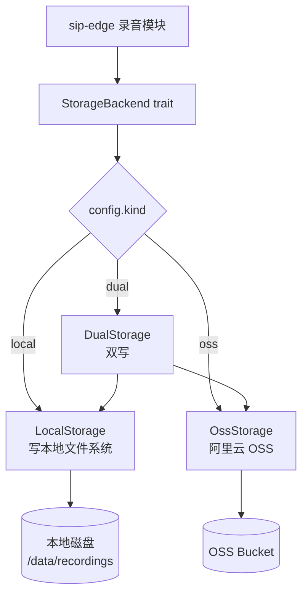

# storage-core

> **统一存储抽象** — 录音文件存本地还是 OSS？这个 crate 让上层不用关心

## 这是什么？

`storage-core` 是 vos-rs 平台的 **文件存储抽象层**。它提供统一的接口，让上层服务（如录音模块）不必关心文件最终存到哪里——可以是本地磁盘、阿里云 OSS、或者两者同时写。

## 核心能力

| 能力 | 说明 |
| :--- | :--- |
| **本地存储** | 开发环境和小规模部署，写本地文件系统 |
| **阿里云 OSS** | 生产环境云存储，高可用 + CDN 加速 |
| **双写模式** | 本地 + OSS 同时写入，数据双保险 |
| **硬件加速** | 某些操作可走硬件加速（见 `hw_accel.rs`） |
| **统一接口** | `StorageBackend` trait，上层无感知切换 |

## 配置

通过 `StorageConfig` 选择后端：

```toml
[storage]
kind = "dual"              # local / oss / dual
base_dir = "/data/recordings"

# OSS 配置（kind = oss 或 dual 时必填）
oss_endpoint = "oss-cn-hangzhou.aliyuncs.com"
oss_bucket = "vos-rs-recordings"
oss_access_key = "xxx"
oss_access_secret = "xxx"
```

对应环境变量：

```bash
VOS_RS_RECORDING_ENABLED=true
VOS_RS_RECORDING_DIR=/data/recordings
```

## 架构图

### 三后端存储架构

上层录音模块只面向 `StorageBackend` trait，由 `StorageConfig.kind` 决定实际写入路径，切换存储介质无需改动业务代码。



## 在项目中的位置

```
sip-edge/media.rs (录音) ──→ storage-core ──→ 本地 FS / 阿里云 OSS
```

`sip-edge` 的 `media.rs` 录音模块通过 `storage-core` 写入录音文件，无需关心底层存储介质。

## 模块结构

| 模块 | 职责 |
| :--- | :--- |
| `lib.rs` | `StorageBackend` trait + `StorageError` |
| `config` | `StorageConfig` 配置结构 |
| `local` | 本地文件系统实现 |
| `oss` | 阿里云 OSS 实现 |
| `hw_accel` | 硬件加速接口 |

## 使用示例

```rust
use storage_core::{StorageBackend, StorageConfig};

let config = StorageConfig::from_env();
let storage = config.build()?;

// 写入录音文件（不关心最终存哪）
storage.put("call_20260101_abc.wav", &audio_bytes).await?;

// 读取
let data = storage.get("call_20260101_abc.wav").await?;
```

## 使用场景

- **通话录音**：每通电话全程录音，WAV 格式
- **CDR 导出**：批量话单导出为 CSV / Excel
- **系统配置**：少量配置文件备份
- **语音素材**：IVR 提示音、背景音乐文件

## 测试

```bash
cargo test -p storage-core
```

OSS 相关测试需要配置真实 OSS 凭证（通过环境变量跳过无凭证场景）。
