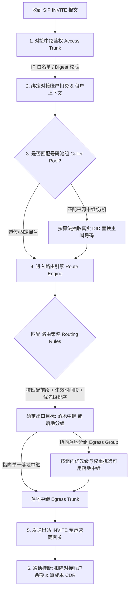

# VOS-RS 中继、路由与号码池关联业务逻辑说明

本文档用于详细梳理 **vos-rs** VoIP 软交换平台中 **对接中继、落地中继、路由策略、落地分组、号码池组** 五大核心业务对象的角色定义、关联逻辑与呼叫处理全流程。

---

## 1. 核心概念与职责角色

在系统的拓扑架构中，中继与路由被严格划分为**接入控制**与**出站路由**两大边界：

| 业务对象 | 英文名称 | 角色定义与核心职责 | 绑定的关联对象 |
| :--- | :--- | :--- | :--- |
| **对接中继** | `Access Trunk` | **入口通道**：代表客户/分机/下游系统送入本平台的呼叫入口。负责 IP 白名单鉴权或 SIP Digest 注册认证。 | 绑定 **对接扣费账户**、租户上下文 |
| **落地中继** | `Egress Trunk` | **出口通道**：代表上游运营商或网关的呼出端点（包含 IP、Port、Transport 协议）。 | 绑定 **落地成本账户** |
| **路由策略** | `Routing Rule` | **单路线路由决策**：根据**被叫前缀、主叫正则匹配与生效时间段**，直接将呼叫指向特定的落地中继。 | 输入：被叫/主叫/时间段；输出：指定 **落地中继** |
| **落地分组** | `Egress Group` | **中继聚合与故障转移**：将多条落地中继打包为路由组，配置组内中继的**优先级、分流权重、生效时间段与故障退避 (Failover)**。 | 包含：多个 **落地中继成员** |
| **号码池组** | `Caller Pool` | **主叫伪装与号源轮询**：针对特定来源（对接中继或分机），提供**虚拟主叫别名**并按算法（均匀随机/权重/轮询/哈希）抽取真实 DID 号码。 | 关联：**对接中继/分机** (来源) + **真实 DID 号码** |

---

## 2. 呼叫处理与选路计算全流程 (Call Routing Flow)

当平台接收到一个公网或内部 SIP 通话请求 (`INVITE`) 时，路由与计费引擎按照以下流程依次执行：

---

## 3. 详细关联业务逻辑

### 3.1 对接中继 vs 落地中继 (Access vs Egress)
1. **信令与媒体解耦 (B2BUA 模式)**：接入侧只关注“谁打进来的、如何扣款”；落地侧只关注“往哪里送包、成本多少”。
2. **计费隔离**：
   - 对接中继挂载 **对接账户 (Access Account)**：实时校验账户余额并进行通话扣费。
   - 落地中继挂载 **落地账户 (Egress Account)**：用于独立核算运营商出站成本。

### 3.2 路由策略 (Routing Rule) 的决策机制
1. **匹配条件**：
   - `匹配前缀` (如 `0086` / `138`，留空匹配任意号码)。
   - `生效时间段` (如 `08:00-22:00` 及生效星期)。
   - `主叫匹配模式` (正则表达式匹配特定主叫)。
2. **出口指派**：
   - 规则可以直接指向**单条落地中继 (`gateway_id`)**。
   - 规则也可以指向**落地分组 (`egress_group_id`)**。

### 3.3 落地分组 (Egress Group) 内部的故障转移与分流
1. **优先级 (Priority)**：优先选择优先级数值较小的落地中继。
2. **权重分流 (Weight)**：同优先级下按权重比例进行流量平滑分流。
3. **故障退避 (Failover)**：当高优先级的落地中继并发达到上限、链路超时或返回 `503 Service Unavailable` 时，系统自动无缝切换到组内下一个备用中继。

### 3.4 号码池组 (Caller Pool) 的绑定与主叫变换
1. **来源绑定**：号码池组通过 `owner_source_type` (对接中继/分机) 和 `owner_source_id` 绑定发起呼叫的入口。
2. **动态选号**：在呼叫进入出站路由计算前，号码池组拦截原始主叫，从关联的真实 DID 号码库中按选号策略（`random` 随机、`round_robin` 轮询等）抽取可用号码替换主叫，实现防封号与合规显号。

---

## 4. 架构设计总结

- **接入层**：`对接中继` + `对接账户` 确保安全鉴权与扣费控制。
- **号码层**：`号码池组` + `真实 DID` 实现主叫合规变换与防封号轮询。
- **路由层**：`路由策略` 实现按前缀、主叫与时间段的 LCR 最低成本/策略选路。
- **出口层**：`落地分组` + `落地中继` + `落地账户` 实现高可用故障转移、多网关分流与成本核算。
