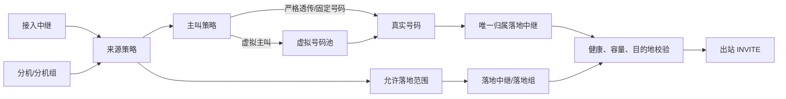
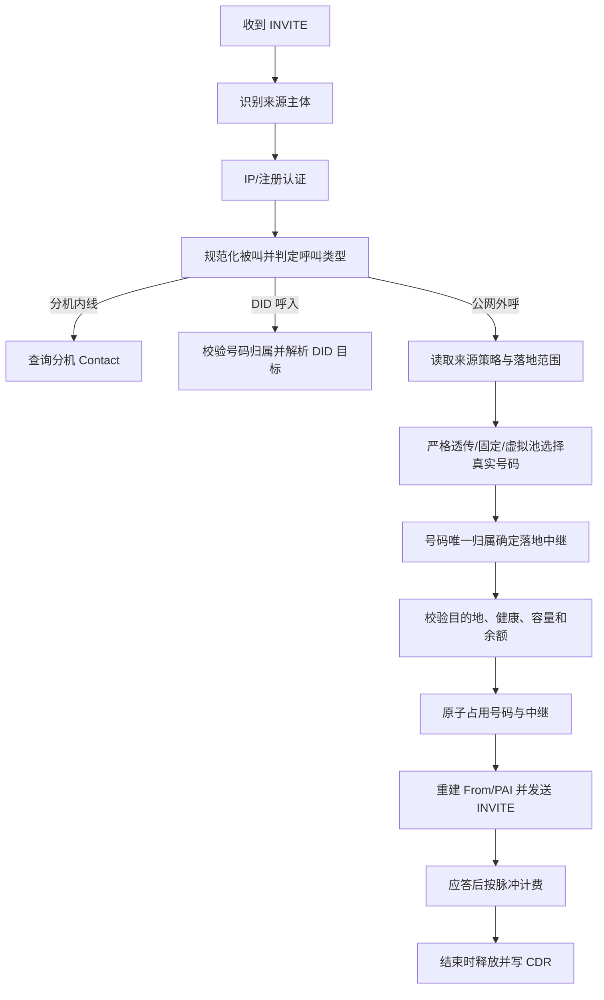

# VOS-RS 中继接入、主叫号码与落地设计

状态：设计确认稿（尚未全部实现）  
更新时间：2026-07-16

本文归纳第三方中继接入、IP/注册认证、真实与虚拟主叫、号码唯一归属、
分机呼叫、DID 呼入、落地选择、计费和 CDR 的目标设计。文中“目标设计”不等于
当前代码已经具备；第 13 节单独列出现状差距。

## 1. 最终设计结论

1. 管理端取消独立“路由管理”概念，将配置收进“落地绑定”和“落地分组”。
2. 内部仍保留呼叫决策引擎；删除页面不等于删除目的地、健康、容量和故障处理。
3. 中继按业务角色区分为“接入中继”和“落地中继”，不再用一个含糊类型混合职责。
4. 接入中继认证支持“IP 白名单”“注册认证”和可选的“IP 加认证”。
5. 一个接入中继可配置多条 IPv4、IPv6 或 CIDR 白名单规则。
6. 第三方注册到平台与平台主动注册上游是两个相反流程，必须使用两套配置和状态机。
7. 真实号码在全系统唯一，并且物理归属于唯一一个落地中继。
8. 号码物理归属与号码使用授权分开建模。
9. 虚拟主叫是业务别名；其号码池成员仍是具有唯一落地归属的真实号码。
10. 透传不是无条件复制 `From`，而是对原始号码规范化、鉴权并查询唯一归属。
11. 主叫策略属于呼叫来源（接入中继、分机或分机组），不属于落地中继。
12. 号码确定后，其唯一归属决定落地中继；落地组只提供授权范围和候选过滤。
13. 同一真实号码不能跨落地中继故障切换；跨中继必须同时更换号码并留痕。
14. 分机内线、DID 呼入和公网外呼是三种独立呼叫类型，不能共用模糊的 outbound 标记。
15. 计费主体是认证后的账户，不是可能被改写的展示主叫号码。

## 2. 领域术语

| 名称 | 定义 |
|---|---|
| 接入中继 | 第三方客户把呼叫送入 VOS-RS 的业务入口 |
| 落地中继 | VOS-RS 向运营商或下游发送公网呼叫的业务出口 |
| 落地端点 | 同一落地中继下的一个 SIP 地址；多个端点可用于同业务中继 HA |
| 落地组 | 来源允许使用的一组落地中继，不拥有号码 |
| 真实号码 | 实际可向公网呈现的号码，全局唯一且唯一归属一个落地中继 |
| 虚拟主叫 | 客户侧业务别名，不直接作为可信公网号码发送 |
| 主叫池 | 虚拟主叫关联的一组真实号码及选号规则 |
| 来源策略 | 接入中继、分机或分机组的主叫策略与允许落地范围 |
| DID 目标 | 真实号码呼入后对应的分机、分机组、IVR 或其他业务目标 |

“接入”和“落地”是业务角色，不是 SIP 报文的网络方向。运营商中继即使向平台发送
DID 呼入，仍属于落地中继；第三方客户中继即使接收回送响应，仍属于接入中继。

## 3. 总体关系



核心不变量是：

```text
真实号码 -> 唯一物理归属落地中继
真实号码 -> 唯一来源授权（默认独占）
虚拟号码池 -> 多个真实号码
池成员 -> 不改变真实号码的落地归属
```

## 4. 中继及条件字段

### 4.1 中继类型

管理页面展示中文，数据库保存稳定枚举：

| 中文 | 枚举 | 说明 |
|---|---|---|
| 接入中继 | `access` | 第三方客户接入平台 |
| 落地中继 | `egress` | 运营商或下游落地 |

不建议提供“万能双向中继”。同一个物理对端同时承担两种业务时，创建两个逻辑中继并
通过备注或对端标识关联，从而避免认证、计费、号码归属和注册方向互相污染。

### 4.2 接入认证

| 中文 | 枚举 | 条件字段 |
|---|---|---|
| IP 白名单 | `ip_allowlist` | 多条来源 IP/CIDR、可选端口、传输协议、备注 |
| 注册认证 | `digest_register` | 用户名、密码、Realm、有效期范围 |
| IP 加认证 | `ip_and_digest` | 同时展示 IP 规则和注册凭据 |

不向公网客户提供“无需认证”。内部压测如需绕过，必须是环境级测试开关，不进入生产
中继表单。

IP 白名单使用重复行组件，而不是逗号分隔文本：

| 来源 IP/CIDR | 端口 | 传输 | 备注 | 启用 |
|---|---:|---|---|---|
| `192.0.2.10/32` | 任意 | UDP | 客户主节点 | 是 |
| `198.51.100.0/24` | 5060 | UDP | 客户灾备网段 | 是 |
| `2001:db8::/64` | 任意 | UDP | IPv6 接入 | 是 |

规则要求：

- 单个 IP 入库时规范化为 IPv4 `/32` 或 IPv6 `/128`。
- 不同接入中继之间禁止存在会导致身份歧义的重叠网段。
- 如确需同一 NAT 公网 IP 接入多个客户，应使用不同来源端口或注册认证。
- 当前实际出站仅完整验证 UDP；其他传输协议在端到端验证前不开放。

### 4.3 落地连接

| 中文 | 枚举 | 条件字段 |
|---|---|---|
| IP 直连 | `static_peer` | 多个落地端点、端口、传输协议、优先级 |
| 主动注册 | `client_register` | 注册服务器、用户名、加密密码、Realm、刷新周期 |

“注册认证”表示第三方向 VOS-RS REGISTER；“主动注册”表示 VOS-RS 向上游
REGISTER。二者不得复用 `supports_registration` 或同一密码字段。

### 4.4 管理页面

中继详情使用四字页签：

- `基本配置`
- `接入认证`
- `注册状态`
- `主叫策略`
- `号码池组`
- `落地绑定`

桌面表单每行两列；IP 规则、端点、号码池成员和注册状态表全宽显示。

## 5. 号码所有权与使用授权

“不同中继不能有相同号码”需要拆成两层约束。

### 5.1 物理归属

`owner_egress_trunk_id` 表示运营商实际承载该号码的落地中继，并决定呼叫从哪里发出。

```text
13800138000 -> 移动落地 A
13900139000 -> 移动落地 B
02160000001 -> 固话落地 C
```

真实号码规范化后全局唯一。推荐统一保存 E.164；原始输入、国内格式和展示格式另存，
避免 `+86138...`、`0086138...` 和 `138...` 形成语义重复。

### 5.2 使用授权

`assigned_source_type + assigned_source_id` 表示谁可以使用该号码：

- 接入中继
- 分机
- 分机组

默认采用独占授权：一个真实号码同一时刻只能授权给一个来源主体。分机组内的多个分机
可以继承组授权，但其他客户中继不能使用该号码。未来如需共享，必须显式增加共享策略，
不能通过删除唯一约束偷偷实现。

### 5.3 号码方向

避免混用 `inbound/outbound/both/bidirectional` 多套字符串，使用两个独立布尔字段：

- `can_receive`：允许作为 DID 接收呼入。
- `can_present`：允许作为公网主叫呈现。

## 6. 主叫策略

### 6.1 中文选项

| 中文 | 枚举 | 行为 |
|---|---|---|
| 严格透传 | `strict_passthrough` | 校验原始主叫存在、启用、已授权，再查询唯一归属 |
| 固定号码 | `fixed_number` | 引用一个已授权真实号码，不能填写任意字符串 |
| 虚拟主叫 | `virtual_pool` | 通过虚拟别名从真实号码池选择号码和归属中继 |

不提供“完全透传”。未知号码没有归属落地中继，也无法满足号码唯一性和防伪要求。

### 6.2 未知或不可用号码

| 中文 | 枚举 | 说明 |
|---|---|---|
| 拒绝呼叫 | `reject` | 默认策略，返回明确 SIP 错误 |
| 固定替换 | `fallback_number` | 使用配置的备用真实号码及其归属中继 |
| 号码池替换 | `fallback_pool` | 从备用池重新选择号码和中继 |

任何替换必须写入 CDR，不允许静默更换。

### 6.3 虚拟号码池

虚拟别名按来源主体隔离，可以映射多个真实号码。池成员字段：

- 真实号码 ID
- 优先级
- 权重
- 最大并发
- 有效时间
- 启用状态

支持算法：

- `random`：可用成员均匀随机。
- `weighted_random`：按权重随机。
- `round_robin`：集群共享轮询游标。
- `stable_hash`：根据来源和被叫稳定选择。
- `priority`：先选最高优先级可用组，再按组内权重选择。

选择结果始终是不可拆分的二元组：

```text
(真实号码, owner_egress_trunk_id)
```

## 7. 落地绑定与内部选路

独立“路由管理”菜单可以取消，但系统仍需判断来源允许范围、被叫方向、目的地前缀、
时间、健康和容量。

### 7.1 绑定方式

来源只能选择一种主要绑定：

- `direct_trunk`：直接绑定一个落地中继。
- `egress_group`：绑定一个落地组。

二者互斥，避免优先级不明确。落地组成员可以配置目的地号段、时段、启用状态和容量，
但不拥有号码，也不能覆盖号码的唯一归属。

### 7.2 透传与固定号码

```text
规范化主叫
-> 查询真实号码及 owner 落地中继
-> 校验 owner 在来源允许落地范围内
-> 校验 owner 支持被叫、健康且容量足够
-> 通过 owner 发起呼叫
```

此时落地组是授权范围，不负责随机选一个中继。

### 7.3 虚拟主叫

```text
读取虚拟池
-> 过滤未授权、停用、并发满和 owner 不可用的成员
-> 过滤 owner 不在来源允许落地范围内的成员
-> 原子选择 (号码, owner)
-> 占用号码和中继并发
-> 发起呼叫
```

### 7.4 故障切换

- 同一落地中继的多个端点可保留原号码重试。
- 不允许携带同一号码切换到另一个落地中继。
- 跨中继故障切换必须使用显式备用号码或从池重新选择。
- 默认失败策略为拒绝，防止号码在未授权中继上呈现。
- 这类出局呼叫禁止跨中继并行 Fork；否则同一号码会被同时送到多个归属不同的中继。

## 8. 分机业务

### 8.1 分机注册

分机凭据与中继凭据使用不同主体命名空间。注册身份至少包含租户、主体类型和用户名，
防止分机 `1001` 与中继 `1001` 互相覆盖 AOR 或 Redis 凭据。

### 8.2 分机内线

```text
认证来源分机
-> 校验内线权限和并发
-> 查询目标分机 Contact
-> 按多终端策略呼叫
```

内线不经过落地中继，不执行公网主叫选择，默认不计费。CDR 标记
`extension_internal`。

### 8.3 分机外呼

策略继承顺序：

```text
分机覆盖 -> 分机组 -> 租户默认
```

分机短号不能直接向公网透传，除非该短号本身是号码库存中的真实号码并已获授权。
固定或虚拟策略选择真实号码后，由号码唯一归属确定落地中继。

### 8.4 DID 呼入

DID 呼入必须先识别来源中继并校验号码归属，再读取独立的 DID 目标：

```text
落地中继呼入
-> 校验该中继拥有被叫号码
-> 查询 DID 目标
-> 分机 / 分机组 / IVR / 拒绝
```

不能继续使用不带中继和租户上下文的全局 `number -> username` 直接跳转。

## 9. 统一呼叫决策



身份认证、并发限制、反欺诈必须发生在信任 `From` 之前；余额开关不得控制鉴权开关。

## 10. SIP 身份头

- 入站第三方提供的 `P-Asserted-Identity` 和 `Remote-Party-ID` 默认不可信。
- 严格透传也需要平台重新生成可信的 `From` 和 `P-Asserted-Identity`。
- 虚拟别名不能直接作为可信 PAI；PAI 使用最终真实号码。
- `Remote-Party-ID` 仅作为每个落地中继的兼容开关，不默认发送。
- 隐私呼叫可使用匿名 `From`、真实 PAI 和 `Privacy: id`，且只发往可信上游。
- 原始主叫保存在内部呼叫上下文和 CDR，不通过自定义头泄露给不可信对端。

## 11. 计费、并发与 CDR

### 11.1 计费主体

- 接入中继外呼：使用接入中继绑定的计费账户。
- 分机外呼：使用分机或分机组绑定的计费账户。
- 展示主叫号码不参与账户识别。
- 内线默认不计费；DID 呼入是否计费由独立产品策略决定。

脉冲计费使用：

```text
计费单元数 = ceil(应答时长秒 / billing_interval_secs)
金额 = 计费单元数 * price_per_interval
```

最大可通话时长应按完整可购买脉冲计算，不能把余额简单按每分钟比例换算。

### 11.2 集群原子状态

号码并发、中继并发、轮询游标和选号租约使用 Redis Lua 或等价原子机制：

- `call_id` 作为幂等租约键。
- 预占包含号码和中继两个资源。
- 失败、挂断和未获胜分支执行幂等释放。
- 租约设置 TTL，节点宕机后可自动回收。
- 配置热更新使用版本号；在途呼叫保存决策快照，不随配置变化中途换号。

### 11.3 CDR 字段

至少新增：

- `call_type`
- `source_principal_type` / `source_principal_id`
- `billing_account_id`
- `original_caller`
- `requested_virtual_alias`
- `presented_caller`
- `caller_policy`
- `caller_pool_id` / `caller_pool_member_id`
- `ingress_trunk_id` / `egress_trunk_id` / `egress_endpoint_id`
- `selection_reason` / `fallback_reason`
- `billing_interval_secs` / `price_per_interval` / `billed_units`

## 12. 目标数据模型

建议逻辑表如下，具体迁移可复用现有表并逐步改名：

| 表 | 核心字段与约束 |
|---|---|
| `sip_trunks` | `id`, `role(access/egress)`, `account_id`, `enabled` |
| `trunk_ip_rules` | `trunk_id`, `cidr`, `source_port`, `transport`; 跨中继禁止歧义重叠 |
| `trunk_credentials` | `trunk_id`, `username`, `realm`, `ha1`; 用户名按租户和主体唯一 |
| `trunk_registrations` | `trunk_id`, `contact`, `flow`, `node`, `expires_at` |
| `egress_endpoints` | `trunk_id`, `host`, `port`, `transport`, `priority`, `enabled` |
| `number_inventory` | `number` 全局唯一，`owner_egress_trunk_id` 非空 FK |
| `number_allocations` | `number`, `source_type`, `source_id`; 默认一个有效授权 |
| `caller_pools` | `owner_source`, `virtual_alias`, `strategy`, `fallback` |
| `caller_pool_members` | `pool_id`, `number`, `priority`, `weight`, `max_concurrent` |
| `egress_groups` | 落地授权范围 |
| `egress_group_members` | `group_id`, `egress_trunk_id`, 目的地能力和时段 |
| `source_outbound_policies` | 来源、主叫模式、固定号码/池、直绑中继/落地组 |
| `did_destinations` | `number`, `target_type`, `target_id`, 租户和启用状态 |

关键删除规则：

- 删除仍拥有号码的落地中继使用 `RESTRICT`，不能级联丢号码。
- 删除被策略引用的号码池使用 `RESTRICT`。
- 删除接入中继可级联其 IP 规则和失效注册状态，但账务与 CDR 保留历史 ID。
- 密码不回显；入站 Digest 存 HA1，主动注册上游的可恢复密钥使用应用层加密/KMS。

## 13. 与当前实现的冲突

| 冲突 | 当前情况 | 目标处理 |
|---|---|---|
| 两套号码归属 | `number_inventory.gateway_id` 和 `gateway_number_assignments` 并存 | 以唯一 owner 字段为真源，废弃多中继归属语义 |
| 中继角色混合 | `sip_gateways` 同时存连接、注册和主叫字段 | 拆角色及子配置，条件字段不再混放 |
| 注册方向混合 | `supports_registration/reg_*` 无法区分谁向谁注册 | 拆接入注册与落地主动注册 |
| IP 身份过宽 | 所有启用网关 host 都可能被当作可信来源 | 使用中继级 CIDR/端口规则解析唯一主体 |
| 主叫策略位置错误 | 策略挂在 RouteTarget/落地网关 | 改挂来源策略，号码决定落地 |
| 主叫未实际改写 | 出站 INVITE 仍复制原始 `From` | 重建 From/PAI 并保存原始值 |
| 路由故障切换 | 408/5xx 可直接换另一个网关 | 同号码只允许同中继端点重试，跨中继必须换号 |
| 跨网关 Fork | 可并行尝试多个候选网关 | 唯一号码出局禁用跨中继 Fork |
| DID 全局映射 | `number -> username` 不校验来源中继 | 先验号码归属，再解析独立 DID 目标 |
| 分机/中继凭据共域 | REGISTER 共享 SIP 用户凭据空间 | 主体类型和租户命名空间隔离 |
| 鉴权受计费开关影响 | 关闭余额控制可能同时绕过 INVITE Digest | 鉴权、计费、反欺诈开关彻底解耦 |
| 计费主体错误 | 可能从 `caller` 反推账户 | 固化认证来源账户，不使用展示号码 |
| CDR 审计不足 | 只有 caller/callee 等基础字段 | 保存完整来源、选号、落地和计费快照 |
| 本地并发状态 | 多节点下状态可能不一致 | Redis 原子租约、TTL、幂等释放 |

## 14. 迁移顺序

1. 审计现有号码规范化重复、空 `gateway_id`、多中继分配和孤儿引用。
2. 新建角色、IP 规则、凭据、端点、号码授权、池、策略和 DID 目标表。
3. 从 `sip_gateways` 和现有号码表回填新模型，冲突数据进入人工处理清单。
4. API 双写旧表与新表；SIP Edge 继续读取旧模型。
5. 完成接入主体识别、Digest REGISTER 归属和多 IP/CIDR 鉴权。
6. 完成严格透传、固定号码、From/PAI 重建和唯一 owner 落地。
7. 完成虚拟池及 Redis 原子选号、并发租约和故障释放。
8. 接入分机外呼、DID 呼入、计费账户和扩展 CDR。
9. SIP Edge 切换读取新模型，保留可回滚版本开关。
10. 稳定运行并完成对账后，停止旧表双写并废弃旧字段和独立路由页面。

禁止在生产使用会 DROP 并重建中继、路由或号码表的全量脚本。迁移必须采用审计、回填、
双写、校验、切读和收紧约束的渐进方式。

## 15. 验收场景

至少覆盖：

1. 一个接入中继配置多个 IPv4/IPv6/CIDR，合法来源可识别，未知来源拒绝。
2. 两个接入中继配置重叠 CIDR 时保存失败并指出冲突对象。
3. 第三方 Digest REGISTER 成功后，INVITE 能识别正确中继和账户；过期后拒绝。
4. 分机和中继使用相同用户名时仍进入不同主体命名空间。
5. 严格透传号码已授权且 owner 健康时，从唯一 owner 落地。
6. 透传未知、未授权或停用号码时按策略拒绝或显式替换。
7. 固定号码不能保存任意文本，只能选择已授权号码。
8. 虚拟池随机/轮询/权重在多节点下不超并发且可幂等释放。
9. 池成员跨多个落地中继时，选号结果与 owner 中继始终一致。
10. owner 同中继端点故障时保持号码切端点；跨中继时不携号切换。
11. 分机内线不走落地、不做公网选号且默认不计费。
12. 分机外呼按分机、分机组、租户顺序继承策略。
13. DID 只能从号码 owner 对应的可信中继呼入并命中正确目标。
14. 主叫改写后仍按来源账户计费，金额按应答时长和脉冲向上取整。
15. CDR 可还原原始主叫、虚拟别名、最终号码、号码池、来源、落地和失败替换原因。

## 16. 实施边界

第一阶段只支持已验证的 UDP。TCP/TLS、平台向上游主动 REGISTER、隐私主叫和 RPID
兼容属于后续能力，必须在具备协议状态机、密钥安全和 SIPp 端到端场景后再开放页面选项。

本设计确认后，建议按“认证与主体 -> 真实号码与主叫改写 -> 虚拟号码池 -> 分机/DID ->
计费与 CDR -> 清理旧模型”分阶段开发，每阶段都必须具备 API 测试、数据库迁移回滚测试
和 SIPp 端到端验证。
