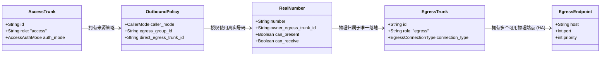
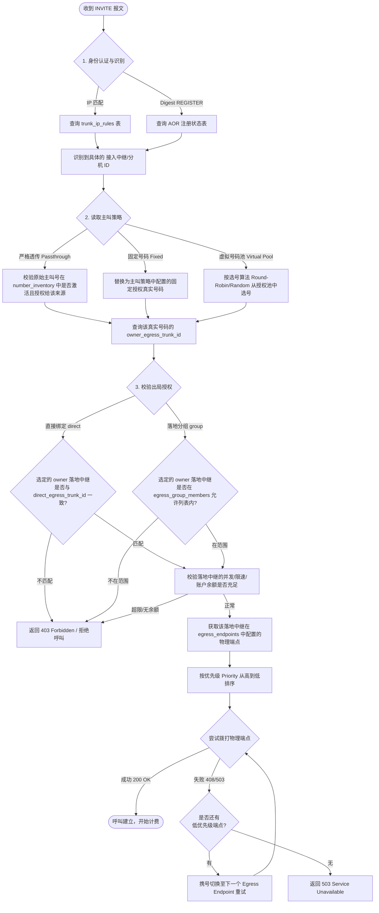

# VOS-RS 中继设计与呼叫选路流程

本系统采用**信令与物理方向解耦、业务角色隔离**的设计模式。中继被严格划分为：
1. **接入中继 (Access Trunk)**：呼叫送入本平台的业务入口（客户侧）。
2. **落地中继 (Egress Trunk)**：呼叫送出本平台向运营商或下游落地的业务出口（上游侧）。

---

## 1. 核心模型关系

在理解流程前，需理清以下核心实体的绑定关系：

> **黄金不变量**：任何一个**真实号码**，物理上**只能归属于唯一一个落地中继**。因此，“号码”决定了“呼叫从哪个落地中继出局”。

---

## 2. 呼叫选路与中继处理完整流程图

当平台收到一个呼叫（`INVITE`）时，系统依次进行**身份识别 ➔ 主叫决策 ➔ 落地匹配 ➔ 物理选路**四个阶段的处理：

---

## 3. 各阶段核心概念解释

### 阶段一：我是谁 (Identity Recognition)
当运营商或客户把 `INVITE` 送到 `sip-edge` 时，系统第一步绝对不信任 `From` 头部填写的号码（因为主叫可以被任意伪造），而是通过**物理来源**或**注册凭证**锁定计费主体：
* 如果是 `IP 白名单` 接入，直接拿 IP + Port 去 `trunk_ip_rules` 里查找中继 ID。
* 如果是 `注册认证` 接入，在 `REGISTER` 阶段完成 Digest 校验，呼叫时匹配绑定的当期用户名。

### 阶段二：我用什么号码出局 (Caller ID Selection)
确定了接入身份后，读取对应的 `OutboundPolicy`（主叫策略）。
* **严格透传**：如果客户送进来的 `From` 号码在号码库里物理归属于平台，且已授权给该客户，则直接放行。如果是未知号码，直接拒绝。
* **固定/号码池**：平台强行将主叫号码改写为已授权给客户的可信真实号码，并从号码属性中获取物理归属的 `owner_egress_trunk_id`。

### 阶段三：我能从这里出局吗 (Authorization Verification)
获取了 `owner_egress_trunk_id` 后，比对客户被允许的落地范围。例如：
* 客户 A 只被允许使用“移动落地组”的通道。
* 但第二阶段选出的主叫号码物理归属于“电信落地中继”。
* 电信不在移动落地组内，系统判定为越权，直接拒绝，防止号码跨网呈现被运营商拉黑。

### 阶段四：我怎么送给运营商 (Physical Delivery & Failover)
前三阶段通过**号码物理归属**确定了出局的中继线。此时：
* 系统不再修改出局主叫号码。
* 到 `egress_endpoints` 中读取该中继下的物理网关 IP 与端口（例如运营商提供的主备两个 SIP 对端 IP）。
* 系统优先把呼叫送到 `priority` 最高（如 100）的 IP 上。
* 如果对端返回 `503` 或网络超时 `408`，系统在**不更改主叫号码**的前提下，自动切换到 `priority` 较低（如 50）的备用 IP 上重试，实现电信级的故障切换。
