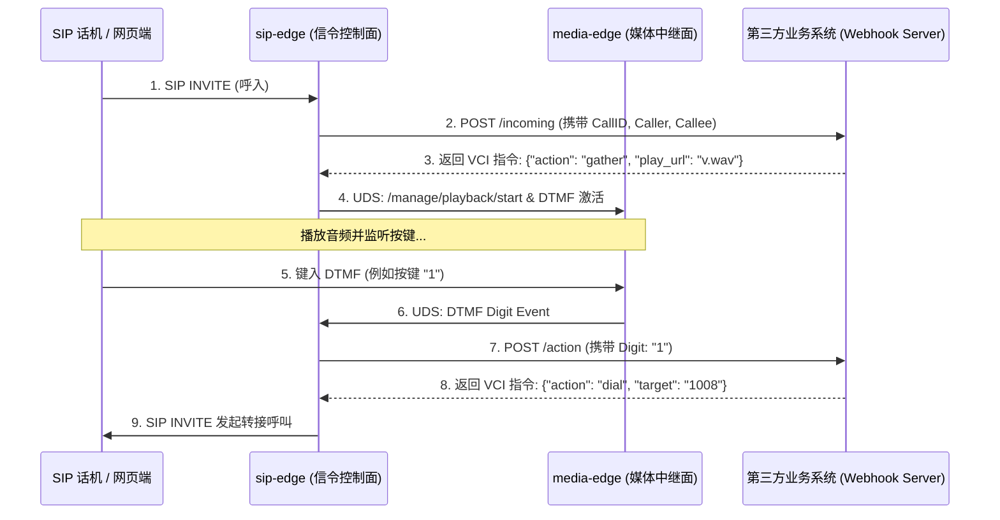

# VOS-RS Webhooks 通话全流程控制与监听系统设计报告

为了全面对标并超越 RustPBX 乃至 Plivo/Twilio 等主流可编程语音平台，我们需要在 VOS-RS 现有的信令隔离底座上，设计并实现一套**高吞吐、双向互动的 Webhooks 呼叫控制与事件监听框架**。

---

## 1. 对标参考项目 (RustPBX) 对比分析

| 维度 | RustPBX Webhooks 设计 | VOS-RS 跨时代 Webhooks 设计 (本方案) | 架构优越性与超越点 |
|:---|:---|:---|:---|
| **事件监听 (Event Hook)** | 传统的 HTTP 异步推送。高并发下可能由于对方 Web 接口慢而导致 Worker 线程积压。 | **异步 RingBuffer 缓冲发布**：事件发布与 HTTP 发送物理隔离，主热路径无任何阻塞。 | **高吞吐保障**：即使第三方接收端宕机，VOS-RS 的呼叫转发和信令面也绝不受任何波及。 |
| **全流程控制 (Control Hook)** | 支持 API 驱动的拨号、排队等控制，指令级颗粒度较粗。 | **VCI (VOS Call Instruction) 指令引擎**：内置细粒度状态驱动（Play/Gather/Dial/Bridge/Record），支持流式挂载。 | **可编程性更强**：第三方开发者可用 Python/Go/Node.js 快速写出复杂的智能 IVR 与大模型对话客服。 |
| **信令集成度** | 信令控制与业务指令耦合较高，修改业务容易影响核心呼叫状态机。 | **完全基于 Sans-I/O 协议驱动的控制块 (Control Block)**：指令执行归属状态机的输入输出，解耦彻底。 | **安全与稳定性**：非法或慢速控制指令只在边界层过滤，核心 B2BUA 状态机绝对不会发生死锁或 panic。 |

---

## 2. 国际标准与参考项目呼叫指令集对比及实现路线图

参考项目（如 RustPBX）和主流可编程语音云（如 Twilio、Plivo）提供了丰富的呼叫控制 XML/JSON 指令。下面对比这些核心指令，评估其在 VOS-RS 当前“信令面与媒体面高度解耦且基于 UDS IPC 交互”架构下的可行性，并梳理出推荐实现的核心路线图：

### 2.1 呼叫控制指令对比评估矩阵

| 指令 (Verb) | 核心功能 | 架构兼容性与技术可行性 | VOS-RS 推荐度与实现优先级 |
|:---|:---|:---|:---|
| **`dial` (转接/桥接)** | 呼叫另一个目的地并将两个 Call Leg 进行媒体桥接。 | **高**：信令面 `sip-edge` 新建 Outbound Leg 并触发 SDP 协商，媒体面使用 Sans-I/O 转发。 | **P0 (必须实现)**：企业客服系统的转接人工、SBC 路由的最核心动作。 |
| **`play` (播放音频)** | 向通道流式播放指定的音频文件。 | **高**：直接通知 `media-edge` 通过无锁缓存及 Direct I/O 读取本地或网络 WAV 文件写入通道。 | **P0 (必须实现)**：播放欢迎词、故障申告、IVR 音频通知。 |
| **`gather` (收集按键)** | 播放提示音并监听 DTMF，收集用户的按键数字。 | **中**：需由 `media-edge` 在数据面提取 RFC 2833 或 带内 DTMF，并将按键事件通过 UDS 回传给信令面。 | **P0 (必须实现)**：菜单分支、按键自助导航、身份验证。 |
| **`hangup` (主动拆线)** | 终止通话，释放所有媒体和中继通道。 | **高**：控制面直接下发 SIP BYE，释放 `AtomicBillingBucket`，数据面清理端口。 | **P0 (必须实现)**：防欺诈异常拦截、用户主动挂机。 |
| **`record` (通话录音)** | 录制通话的单向或双向混音音频。 | **高**：数据面已具备 Direct I/O 对齐写入 WAV，只需由指令触发/停止。 | **P1 (强烈推荐实现)**：金融合规存证、质检归档。 |
| **`stream` (流式传输)** | 将实时音频通过 WebSockets 发送给第三方 AI 服务。 | **高**：`media-edge` 已经构建了极低延迟的标准 AI 二进制流协议，只需指令化挂载。 | **P1 (强烈推荐实现)**：**VOS-RS 的最大特色优势**，直连外部 AI 大模型实时双向语音通话。 |
| **`say` (TTS文本发音)** | 通过 TTS 引擎将文本发音播放给用户。 | **中**：平台如果内置 TTS 引擎会显著加重系统开销，破坏信令轻量化原则。 | **P2 (不推荐内置)**：建议在外部 AI 插件中将文字渲染为 PCM 流后回传，或使用 `play` 播放预先渲染的音频。 |
| **`queue` (排队等待)** | 将通话置入排队等待队列中，播放等待背景音。 | **低**：需要控制面内置复杂的 ACW 调度、坐席状态机与技能队列管理。 | **P2 (不建议近期实现)**：呼叫中心排队逻辑较重，应当在第三方呼叫中心（CC）系统层面做调度。 |
| **`conference` (多方会议)** | 将呼叫桥接入多人混音会议室。 | **中**：数据面需要启用 RTP 混音网桥。目前 `media-edge` 内部已经设计并预留了 `ConferenceManager`。 | **P2 (后续版本选配)**：多方电话会议室。 |

### 2.2 VOS-RS VCI 指令开发路线图

* **第一阶段 (Core v1.0 - P0 核心级)**：实现 `dial`、`play`、`gather`、`hangup` 四大指令。这是构成 90% 通信应用的最精简且最健壮的最小可行性指令集，完全能跑通闭环 IVR 控制。
* **第二阶段 (Advanced v1.1 - P1 AI/高阶级)**：实现 `record` 与 `stream` 指令。将录音与外部 AI 标准流式协议（AI Voice Plugin Protocol）正式纳入 Webhooks 的按需指令调度中。
* **第三阶段 (Enterprise v2.0 - P2 企业级)**：根据用户需要，后续实现 `conference` (多人电话会议) 网桥指令。

---

## 3. 系统核心架构设计

VOS-RS Webhooks 体系分为两大核心子系统：
1. **事件推送系统 (Event Publish Hook - 异步单向)**：监听通话生命周期中的状态事件（呼入、振铃、接通、挂断、按键等），流式 JSON 推送给第三方。
2. **呼叫控制系统 (Interactive Control Hook - 同步双向)**：当被叫路由配置为 Webhook 控制时，暂停通话建立，向第三方接口请求指令集，并根据应答驱动媒体与信令。

### 3.1 Webhooks 呼叫交互时序图



---

## 4. VOS Call Instruction (VCI) 最大化指令集协议规范

我们为双向控制接口定义了一套完备的高阶 JSON 指令集（共 12 大动作动词），涵盖从基础呼叫、媒体播收，到大模型流式透传、多方会议与排队等待的所有工业场景。

### 4.1 播放提示音 (Play)
播放指定 URL 的音频文件，支持配置循环次数：
```json
{
  "action": "play",
  "url": "http://oss.vos-rs.local/audios/welcome.wav",
  "loop_count": 3
}
```

### 4.2 收集按键 (Gather)
播音的同时监听 DTMF 按键。支持按键打断（`barge_in`）以及指定截止符：
```json
{
  "action": "gather",
  "play_url": "http://oss.vos-rs.local/audios/menu.wav",
  "max_digits": 6,
  "timeout_ms": 10000,
  "inter_digit_timeout_ms": 3000,
  "finish_on_key": "#",
  "barge_in": true
}
```

### 4.3 转接 / 多路外呼 (Dial)
触发呼叫桥接，支持并发多路同时振铃（`sim_ring`）和单人接听抢占：
```json
{
  "action": "dial",
  "targets": ["1008", "1009"],
  "sim_ring": true,
  "caller_id": "88889999",
  "timeout_secs": 45,
  "record_call": true
}
```

### 4.4 挂断电话 (Hangup)
主动终止通话，支持指定 SIP 挂机原因码：
```json
{
  "action": "hangup",
  "reason_code": 16,
  "sip_cause": 486
}
```

### 4.5 通话录音 (Record)
对当前通话的单侧或双侧混音进行即时录音，支持静音自动截止判定：
```json
{
  "action": "record",
  "max_length_secs": 3600,
  "play_beep": true,
  "trim_silence": true,
  "silence_threshold_db": -40
}
```

### 4.6 大模型流式桥接 (Stream)
将当前通话的实时双向语音直接以 WebSocket 二进制流形式桥接至外部 AI 大模型（如 GPT-4o Realtime）：
```json
{
  "action": "stream",
  "websocket_url": "ws://ai-agent.local/v1/stream",
  "format": "pcm16",
  "barge_in": true
}
```

### 4.7 文本合成语音播音 (Say - TTS)
利用外部云端或本地 TTS 渲染引擎，实时将文本转换为语音在通道中播放：
```json
{
  "action": "say",
  "text": "您好，您的账户余额已低于十元，请及时充值。",
  "voice": "zh-CN-XiaoxiaoNeural",
  "speed": 1.0,
  "pitch": 0
}
```

### 4.8 呼叫入队排队 (Queue)
将呼叫置入排队等待队列中，循环播放等待背景音乐（MOH），直到有空闲坐席应答：
```json
{
  "action": "queue",
  "queue_id": "premium_line",
  "moh_url": "http://oss.vos-rs.local/audios/moh.wav",
  "priority": 1
}
```

### 4.9 加入多方会议 (Conference)
将通话桥接进多方混音会议室：
```json
{
  "action": "conference",
  "room_id": "9999",
  "start_muted": false,
  "end_on_exit": true,
  "max_participants": 20
}
```

### 4.10 重定向路由 (Redirect)
将当前的 Webhook 呼叫交互链路，完全 302 重定向重定向至另一个第三方 Webhook URL 接口：
```json
{
  "action": "redirect",
  "url": "http://crm-system.local/billing/webhook"
}
```

### 4.11 静默等待 (Pause)
静默等待指定时长，不播放任何声音并保持呼叫处于在线状态：
```json
{
  "action": "pause",
  "duration_ms": 5000
}
```

### 4.12 播送 DTMF 信号 (PlayDigits)
向通道反向播送一段指定 DTMF 信号（模拟按键），常用于自动外呼后呼打分机：
```json
{
  "action": "play_digits",
  "digits": "1234#",
  "duration_ms": 250
}
```

---

## 5. 控制与监听逻辑开发方案

### 4.1 新增控制模块 `crates/call-core/src/webhooks.rs`
我们将在 `call-core` 中定义这套核心的指令集与推送事件：

```rust
//! # Webhooks 全流程监听与交互控制数据结构

use serde::{Serialize, Deserialize};

/// 第三方事件监听推送的事件类型
#[derive(Debug, Clone, Serialize, Deserialize)]
#[serde(tag = "event_type", rename_all = "snake_case")]
pub enum CallEvent {
    CallInitiated {
        call_id: String,
        caller: String,
        callee: String,
        timestamp: i64,
    },
    CallRinging {
        call_id: String,
        timestamp: i64,
    },
    CallAnswered {
        call_id: String,
        timestamp: i64,
    },
    DtmfReceived {
        call_id: String,
        digits: String,
        timestamp: i64,
    },
    CallFinished {
        call_id: String,
        duration_secs: u64,
        release_cause: u8,
        timestamp: i64,
    },
}

/// 第三方双向控制返回的指令动作
#[derive(Debug, Clone, Serialize, Deserialize, PartialEq, Eq)]
#[serde(tag = "action", rename_all = "snake_case")]
pub enum VciInstruction {
    Play {
        url: String,
        loop_count: u32,
    },
    Gather {
        play_url: Option<String>,
        max_digits: usize,
        timeout_ms: u64,
    },
    Dial {
        target: String,
        caller_id: Option<String>,
    },
    Hangup {
        reason_code: u8,
    },
}
```

### 4.2 异步事件发送队列
在 `sip-edge` 和 `api-server` 启动时，注册一个专职的 `WebhookEventExecutor`：
- 事件触发时，只需通过有界异步通道投递：`event_tx.try_send(event)`。
- 后台循环从 `event_rx` 批量拉取数据，并使用 `reqwest` 或高并发客户端，异步推送给用户配置的 HTTP URL。支持指数退避重试，防止短时抖动丢事件。

---

## 5. 验证与单元测试规划

1. **VCI 序列化测试 (`test_vci_instruction_deserialization`)**：
   * 验证各种 VCI JSON（Play/Gather/Dial/Hangup）能在 Rust 中反序列化为正确的强类型枚举。
2. **事件监听流式推送测试 (`test_webhook_event_publish_loop`)**：
   * 启动 Mock Webhook Server，触发 `CallInitiated` 与 `CallFinished` 事件，验证 Mock 端能以符合标准的协议格式成功且低延迟地收到 POST 通告。
