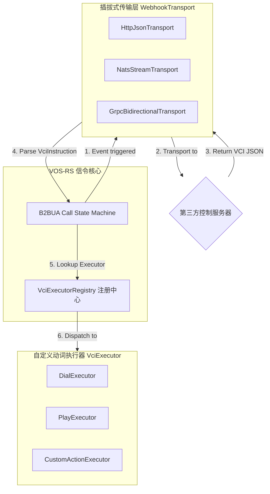

# VOS-RS Webhooks 可扩展性与插拔式多通道架构设计方案

为了确保 VOS-RS Webhooks 体系能够在未来动态承载更多自定义指令、支持多种传输协议（HTTP/NATS/gRPC）、且在升级过程中不侵入或破坏核心 B2BUA 信令状态机，我们设计了以下**面向未来的插拔式 Webhooks 扩展方案**。

---

## 1. 核心扩展维度设计

本方案围绕两个核心切入点进行高可扩展性解耦：
1. **传输通道抽象 (Transport Channel Decoupling)**：允许将控制事件和指令返回通道从 HTTP，无缝扩展到高吞吐的 NATS 消息队列、高性能的双向 gRPC 流或 Kafka。
2. **指令执行解耦 (Action Execution Decoupling - 动态注册)**：利用执行器模式（Executor Pattern），允许开发者通过注册中心（Registry）动态挂载自定义的控制动词，核心状态机只需对指令类型做统一抽象。



---

## 2. 接口抽象与 Rust 蓝图

### 2.1 传输通道抽象 (`WebhookTransport` Trait)
平台不再绑定在 `reqwest` HTTP 发送上。只要实现了 `WebhookTransport`，就能作为信令的事件源 and 指令交互管道：

```rust
use async_trait::async_trait;
use crate::webhooks::{CallEvent, VciInstruction};

/// Webhooks 双向通信传输通道抽象
#[async_trait]
pub trait WebhookTransport: Send + Sync {
    /// 异步单向广播通话生命周期状态事件
    async fn publish_event(&self, event: CallEvent) -> Result<(), String>;

    /// 同步双向发送交互事件，并挂起等待第三方返回下一步的 VCI 控制指令集
    async fn send_event_and_wait_instruction(
        &self,
        call_id: &str,
        event: CallEvent,
    ) -> Result<Vec<VciInstruction>, String>;
}
```

#### 2.1.1 扩展场景：NATS JetStream 异步传输实现蓝图
在大容量高吞吐的 VOS 部署场景中，使用 NATS 队列可以达成极佳的削峰填谷效果：

```rust
pub struct NatsWebhookTransport {
    nats_client: async_nats::Client,
    event_subject: String,
    instruction_subject: String,
}

#[async_trait]
impl WebhookTransport for NatsWebhookTransport {
    async fn publish_event(&self, event: CallEvent) -> Result<(), String> {
        let payload = serde_json::to_vec(&event).map_err(|e| e.to_string())?;
        self.nats_client
            .publish(self.event_subject.clone(), payload.into())
            .await
            .map_err(|e| e.to_string())?;
        Ok(())
    }

    async fn send_event_and_wait_instruction(
        &self,
        _call_id: &str,
        event: CallEvent,
    ) -> Result<Vec<VciInstruction>, String> {
        // 利用 NATS Request-Reply (REQ/REP) 模型，达成毫秒级、低开销的同步控制指令交互
        let payload = serde_json::to_vec(&event).map_err(|e| e.to_string())?;
        let reply = self.nats_client
            .request(self.instruction_subject.clone(), payload.into())
            .await
            .map_err(|e| e.to_string())?;
        
        let instructions: Vec<VciInstruction> = serde_json::from_slice(&reply.payload)
            .map_err(|e| e.to_string())?;
        Ok(instructions)
    }
}
```

---

### 2.2 指令执行器动态解耦 (`VciExecutor` Trait)
每个指令动词都有一个独立的物理执行器，通过注册中心按需分发，避免了信令状态机内部的巨型 Hardcode `match` 块：

```rust
use std::sync::Arc;
use crate::manager::CallManager;
use crate::webhooks::VciInstruction;

/// 通话控制指令执行环境上下文
pub struct VciContext {
    pub call_id: String,
    pub manager: Arc<CallManager>,
}

/// 可执行指令的最小动作单元
#[async_trait]
pub trait VciExecutor: Send + Sync {
    /// 指令类型名称 (例如 "dial", "play")
    fn action_name(&self) -> &'static str;

    /// 执行动作核心业务逻辑
    async fn execute(&self, ctx: &VciContext, instruction: &VciInstruction) -> Result<(), String>;
}
```

#### 2.2.1 自定义动作扩展示例 (`CustomFraudCheckExecutor`)
如果第三方想扩展自定义风控熔断（例如在接通时，动态向核心添加 IP 拦截）：

```rust
pub struct CustomFraudCheckExecutor;

#[async_trait]
impl VciExecutor for CustomFraudCheckExecutor {
    fn action_name(&self) -> &'static str {
        "custom_fraud_check"
    }

    async fn execute(&self, ctx: &VciContext, instruction: &VciInstruction) -> Result<(), String> {
        // 在这里获取通话上下文，并调用 SBC 防欺诈模块或者核心路由网卡黑名单添加
        println!("Executing custom fraud check for call: {}", ctx.call_id);
        Ok(())
    }
}
```

---

## 3. 指令与事件的多版本兼容 (Versioning)

在 JSON 载荷中引入规范的协议版本定义。我们在 `CallEvent` 中通过 `vci_version` 进行约束。在反序列化时，若第三方返回的格式与当前不匹配，可通过版本路由层分流反序列化为不同的数据结构：

```json
{
  "event_type": "call_initiated",
  "vci_version": "2.1",
  "call_id": "call_9999",
  "caller": "1001",
  "callee": "1002"
}
```

VOS-RS 的指令解析器根据 `"vci_version"` 采用对应的解析适配器，从而保证系统升级后，原先以 `v1.0` 运行的第三方系统绝不报错中断。
