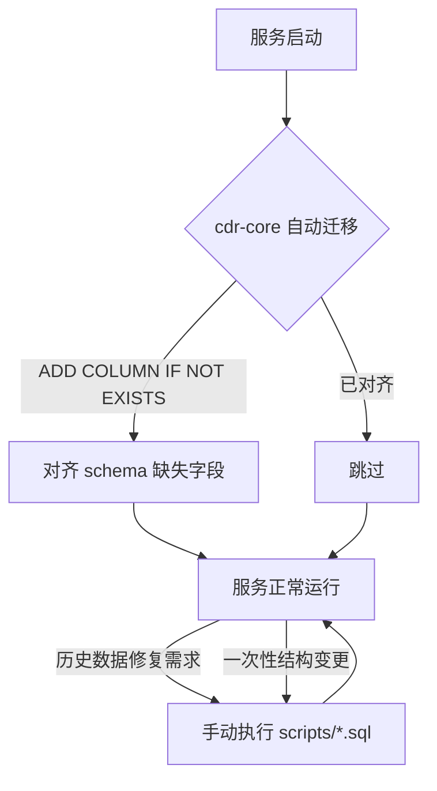

# scripts — 数据库迁移与开发脚本

> **数据库 SQL 迁移 + 开发辅助脚本集合**

## 这是什么？

`scripts/` 是 vos-rs 项目的 **数据库迁移和开发辅助脚本** 目录。包含：
- SQL 迁移脚本（建表、补字段、修数据）
- Python 开发工具（截图、配置检查、场景模拟）

> **注意**：cdr-core 启动时会自动执行 schema 迁移（`ALTER TABLE ... ADD COLUMN IF NOT EXISTS`），这些 SQL 脚本主要用于**一次性数据修复**和**历史迁移**，日常运行不需要手动执行。

## 迁移流程图



> 自动迁移只补字段不删表；涉及数据回填、表结构重写、索引重建等场景，仍需手动执行 `scripts/` 下的 SQL。

## 脚本清单

### SQL 迁移脚本

| 脚本 | 用途 |
| :--- | :--- |
| `ivr_seed.sql` | IVR 测试数据（5 个菜单 + nodes/edges 拓扑） |
| `full_refactor.sql` | 全量重构 SQL（历史迁移） |
| `anti_fraud_migration.sql` | 反欺诈规则表迁移 |
| `billing_account_id_migration.sql` | 计费账户 ID 字段迁移 |
| `extensions_migration.sql` | 分机表迁移 |
| `gateway_enhancement_migration.sql` | 网关增强字段迁移 |
| `migration_weight_health.sql` | 路由权重 + 健康字段迁移 |
| `number_inventory_enhancement.sql` | 号码库存增强 |
| `20260716_billing_intervals.sql` | 计费间隔配置 |
| `20260716_domain_schema_alignment.sql` | 终结域 schema 对齐 |
| `clean_history_data.sql` | 清理历史数据 |

### Shell 脚本

| 脚本 | 用途 |
| :--- | :--- |
| `dev.sh` | 开发环境启动脚本 |
| `clean_data.sh` | 清理测试数据 |

### Python 脚本

| 脚本 | 用途 |
| :--- | :--- |
| `check_settings.py` | 检查系统配置 |
| `screenshot.py` | Web 界面截图工具 |
| `simulate_and_log_scenarios.py` | 场景模拟与日志 |
| `test_vci_scenarios.py` | VCI 场景测试 |

## 使用示例

```bash
# 执行 IVR 测试数据初始化
psql -U tangyu -d vos_rs -f scripts/ivr_seed.sql

# 清理历史数据
psql -U tangyu -d vos_rs -f scripts/clean_history_data.sql

# 启动开发环境
bash scripts/dev.sh
```

## 相关文档

- 环境变量：[../docs/development/ENV_VARS.md](../docs/development/ENV_VARS.md)
- 数据库 schema：[../crates/cdr-core/src/schema.rs](../crates/cdr-core/src/schema.rs)
