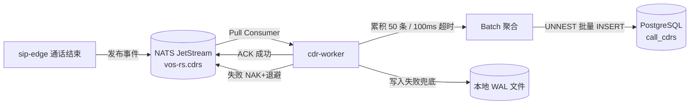
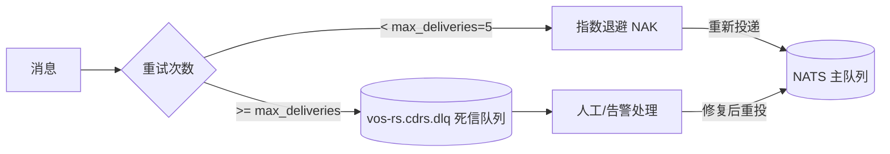

# cdr-worker — CDR 异步写入服务

> **vos-rs 的 CDR 落库worker** — 从 NATS 消费通话话单事件，批量写入 PostgreSQL

## 这是什么？

`cdr-worker` 是 vos-rs 平台的 **异步任务服务**。它不直接处理电话，而是负责把通话结束后产生的 CDR（Call Detail Record，通话详单）异步写入数据库。

为什么要单独起一个服务？
- **削峰填谷**：高峰期 1000 CPS 意味着每秒 1000 条 CDR，直接写数据库会拖垮 PG
- **批量写入**：累积 50 条批量 INSERT，比逐条写快 10 倍+
- **解耦**：`sip-edge` 只管发事件到 NATS，不关心数据库是否可用

打个比方：`sip-edge` 是餐厅服务员，每桌结账后扔一张账单到篮子（NATS）；`cdr-worker` 是会计，每隔一段时间从篮子里拿一摞账单，批量录入财务系统（PostgreSQL）。

## 架构

```text
sip-edge (通话结束)
    │
    │ 发布 CDR 事件
    ▼
NATS JetStream (持久化消息队列)
    │
    │ 拉取消费
    ▼
cdr-worker
    │
    │ 批量 INSERT
    ▼
PostgreSQL (call_cdrs 表)
```

## 架构图

### NATS → Worker → PG 数据流



### DLQ 死信队列流转



> DLQ 应长期积压为 0；突增意味着数据库长时间不可用或 schema 不匹配，需立即介入。

## 核心能力

| 能力 | 说明 |
| :--- | :--- |
| **批量写入** | 累积 50 条或 100ms 超时后批量 INSERT，UNNEST 加速 |
| **超时刷新** | 批量未满时按 100ms 超时强制刷新，避免延迟 |
| **死信队列 (DLQ)** | 写入失败 5 次的 CDR 进入 `vos-rs.cdrs.dlq`，避免阻塞 |
| **指数退避** | 数据库不可用时指数退避重试，最大 3 次 |
| **幂等性** | 按 `call_id` 去重（NATS consumer 幂等读取） |
| **NATS 持久化** | JetStream 模式，worker 宕机不丢消息 |
| **WAL 备份** | 批量写入失败时落本地 WAL 文件，二次兜底 |

## 关键参数

| 参数 | 默认值 | 说明 |
| :--- | :--- | :--- |
| `batch_size` | 50 | 单批最大 CDR 条数 |
| `batch_timeout_ms` | 100 | 批量未满时的超时刷新间隔 |
| `max_deliveries` | 5 | 单条 CDR 最大重试次数，超过进 DLQ |
| `nak_delay_ms` | 1000 | NAK 后的重试延迟 |
| `db_retry_attempts` | 3 | 数据库写入失败重试次数 |

## 在项目中的位置

```text
sip-edge ──CDR 事件──→ NATS JetStream ──→ cdr-worker ──→ PostgreSQL
                                              │
                                              └──→ WAL 文件 (失败兜底)
```

`cdr-worker` 只依赖 `cdr-core`，是数据落库的最后一环。

## 模块结构

| 模块 | 职责 |
| :--- | :--- |
| `main.rs` | 单文件实现（约 400 行），含消费者创建、批量聚合、写入、重试、DLQ |

虽然单文件，但职责清晰：
1. 连接 NATS，创建/获取 Pull Consumer
2. 循环拉取消息，聚合到批次
3. 批次满或超时，调用 `cdr-core` 批量 INSERT
4. 成功 ACK，失败 NAK + 指数退避
5. 超过 `max_deliveries` 的消息进 DLQ

## 运行

### 本地开发

```bash
cargo run -p cdr-worker --release
```

### Docker

```bash
docker run -d --name cdr-worker \
  -e VOS_RS_DATABASE_URL=postgres://user:pass@db:5432/vosrs \
  -e VOS_RS_NATS_URL=nats://nats:4222 \
  vos-rs:cdr-worker
```

### systemd

```bash
sudo systemctl enable --now cdr-worker
```

## 监控

关键指标（通过日志观察）：

```bash
sudo journalctl -u cdr-worker -f | grep -E "batch|DLQ|retry"
```

关注：
- 批量写入延迟（应 < 200ms）
- DLQ 积压（应长期为 0）
- 重试次数（突增说明数据库有问题）

## 部署建议

- **单实例**即可处理 5000+ CDR/s，无需横向扩展
- 如需高可用，可部署 **2 实例**，NATS Consumer 会自动负载均衡
- 数据库写入压力大时，调大 `batch_size` 到 200-500

## 测试

### 单元测试

```bash
cargo test -p cdr-worker
```

### 端到端测试

启动完整链路后，用 SIPp 打流量，观察 CDR 是否正确落库：

```bash
cd tools/sipp && ./run_cps_rec.sh 100 10 10
psql -c "SELECT count(*) FROM call_cdrs WHERE created_at > now() - interval '5 min'"
```

## 相关文档

- 服务总览：[../README.md](./README.md)
- NATS VCI 设计：[../../docs/architecture/NATS_VCI_COMMAND_DESIGN.md](../../docs/architecture/NATS_VCI_COMMAND_DESIGN.md)
- 环境变量：[../../docs/development/ENV_VARS.md](../../docs/development/ENV_VARS.md)
