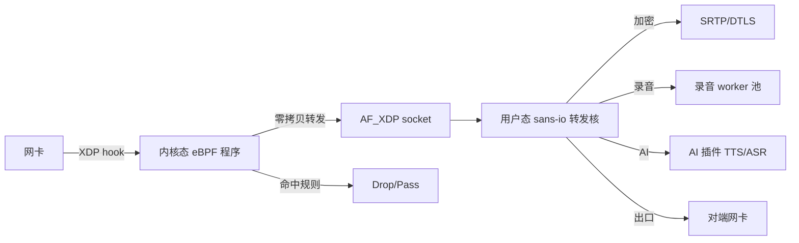
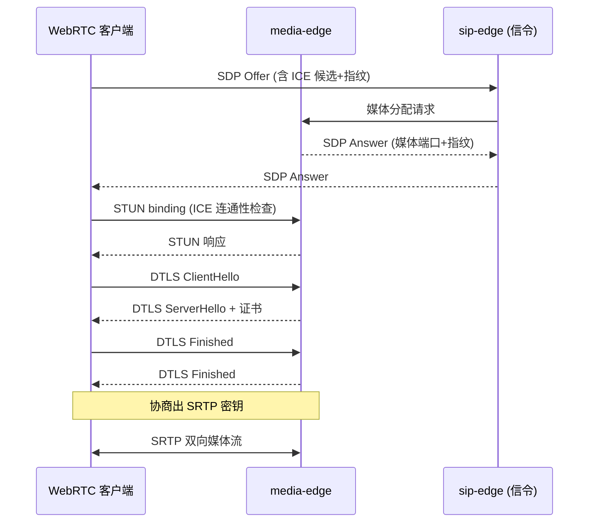

# media-edge — 下一代媒体边缘服务

> **vos-rs 的媒体中继服务** — eBPF/XDP 内核旁路加速的高性能 RTP 转发
>
> ℹ️ 部分能力为规划中（Planned），以实际支持为准。

## 这是什么？

`media-edge` 是 vos-rs 平台的 **下一代媒体中继服务**。与 `sip-edge` 内置的传统 RTP 中继不同，`media-edge` 采用 eBPF/XDP 内核旁路技术，把 RTP 包处理从用户态下沉到内核态，目标实现 10 万路+ RTP 转发。

> ℹ️ eBPF/XDP 10 万路转发能力为规划中（Planned），以实际版本支持为准。

适用场景：
- 大规模呼叫中心（数千路并发录音）
- AI 语音机器人（高密度媒体流处理）
- WebRTC 网关（DTLS-SRTP 加密媒体）

## 核心能力

| 能力 | 说明 |
| :--- | :--- |
| **eBPF/XDP 内核旁路** | RTP 包在内核态转发，零拷贝，目标 10 万路+ |
| **io_uring 异步 I/O** | Linux 5.1+ 异步 I/O，减少系统调用 |
| **WebRTC 支持** | DTLS-SRTP 加密 + ICE 候选 + SDP 协商 |
| **AI 插件接口** | 热插拔 AI Voice Agent / TTS / ASR |
| **全局 Mesh** | 跨节点媒体流转发，边缘云协同 |
| **Sans-IO 设计** | 网络层与业务层解耦，便于测试 |
| **录音池** | 独立录音 worker 线程池，不阻塞转发 |

> ℹ️ 「全局 Mesh」「AI 插件接口」等高级能力部分为规划中（Planned），以实际支持为准。

## 在项目中的位置

```text
sip-edge (信令) ──媒体分配请求──→ media-edge (媒体中继)
                                    │
                                    ├──→ eBPF/XDP (内核旁路转发)
                                    ├──→ WebRTC (DTLS-SRTP)
                                    ├──→ AI 插件 (TTS/ASR)
                                    └──→ 录音池 (异步落盘)
```

`media-edge` 与 `sip-edge` **信令媒体分离**部署，可独立扩展。

## 架构图

### eBPF/XDP 内核旁路数据路径



### WebRTC DTLS-SRTP 握手时序



> ℹ️ eBPF/XDP 数据路径与 WebRTC 网关部分能力为规划中（Planned），以实际版本支持为准。

## 模块结构

| 模块 | 职责 |
| :--- | :--- |
| `media/relay/` | RTP 中继核心（eBPF/io_uring/sans_io/affinity） |
| `media/relay/webrtc/` | WebRTC 支持（DTLS/ICE/SRTP/session） |
| `media/conference.rs` | 多方会议混音 |
| `media/transcode.rs` | 实时转码（Opus ↔ G.711） |
| `media/live_transcode.rs` | 流式转码 |
| `media/recording.rs` | 录音（异步 worker 池） |
| `media/dtmf.rs` | DTMF 检测 |
| `media/crypto.rs` | SRTP 加解密 |
| `media/sdp.rs` | SDP 协商 |
| `media/wav.rs` | WAV 文件读写 |
| `media/metrics.rs` | Prometheus 指标 |
| `config.rs` | 配置加载 |

## 性能基准

```bash
cargo bench -p media-edge
```

`benches/xdp_media_engine_stress.rs` 含 eBPF 媒体引擎压测，目标 10 万路 RTP 转发。

> ℹ️ eBPF/XDP 内核旁路压测目标为规划中（Planned），实际单机容量以版本基线为准。

## 运行

### 前置要求

- Linux 5.15+（eBPF/XDP 支持）
- root 权限（加载 eBPF 程序）
- 网卡支持 XDP 驱动模式（多数现代网卡支持）

### 本地运行

```bash
sudo cargo run -p media-edge --release
```

### Docker

```bash
docker run -d --name media-edge \
  --privileged \
  --device /dev/net/tun \
  -p 40000-40200:40000-40200/udp \
  vos-rs:media-edge
```

## 与 sip-edge 的关系

`media-edge` 是 `sip-edge` 内置媒体中继的**演进版本**：

| 对比项 | sip-edge 内置媒体 | media-edge |
| :--- | :--- | :--- |
| 架构 | 用户态 recvfrom/sendto | eBPF/XDP 内核旁路 |
| 单机容量 | 5000 路 | 10 万路+ |
| 部署 | 与信令同进程 | 独立进程/机器 |
| 适用 | 中小规模 | 超大规模 |
| WebRTC | 不支持 | 支持 |

## 相关文档

- 服务总览：[../README.md](./README.md)
- RTP/SIP 完整性：[../../docs/architecture/rtp-sip-completeness.md](../../docs/architecture/rtp-sip-completeness.md)
- 集群部署：[../../docs/deployment/CLUSTER_DEPLOYMENT.md](../../docs/deployment/CLUSTER_DEPLOYMENT.md)
