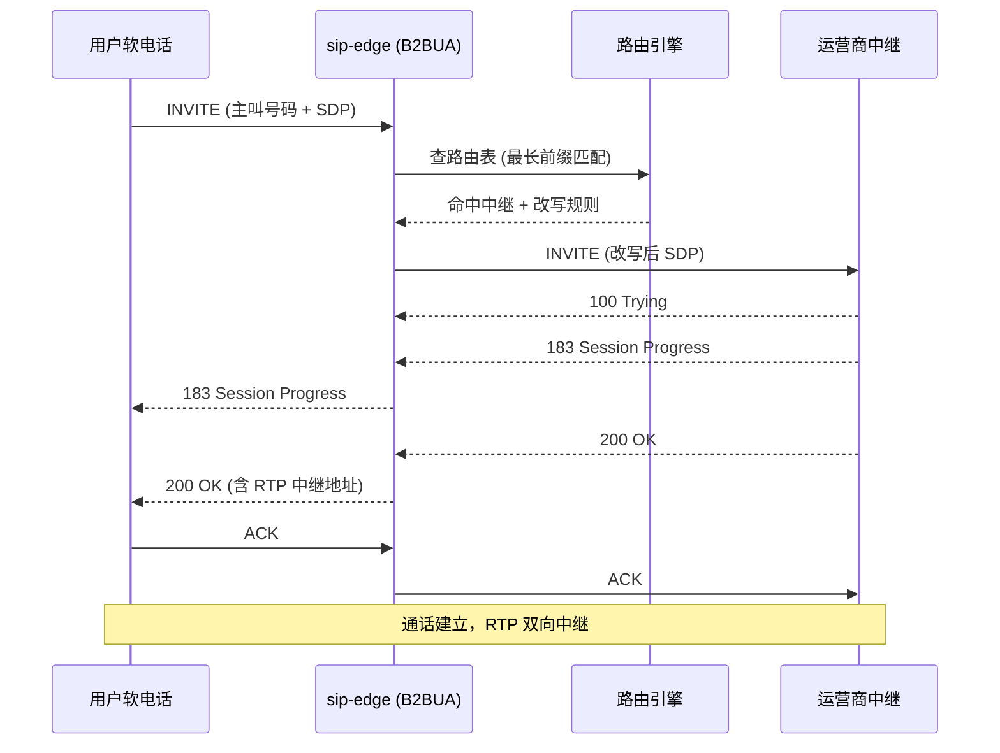
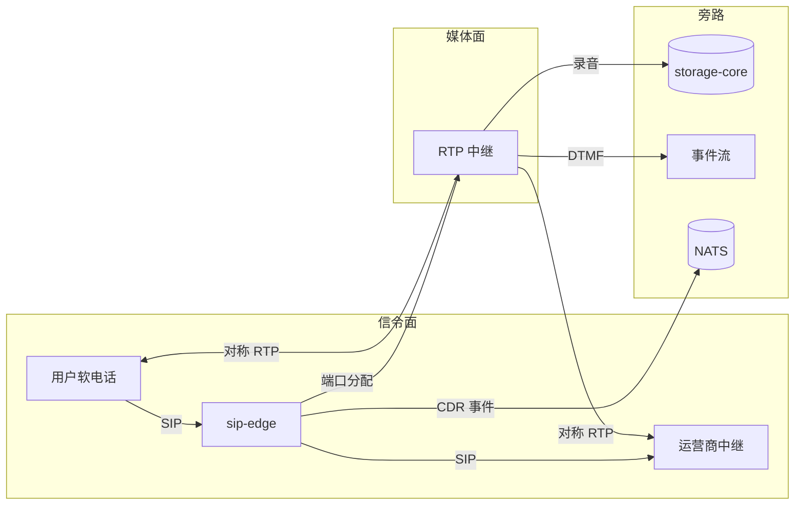

# sip-edge — SIP B2BUA 核心服务

> **vos-rs 的核心服务** — 处理 SIP 信令 + RTP 媒体中继 + 路由 + 计费

## 这是什么？

`sip-edge` 是 vos-rs 平台的 **核心服务**。它是一个 SIP B2BUA（Back-to-Back User Agent），扮演「中间人」角色：
- 接收用户的 SIP 呼叫请求（INVITE）
- 查路由表决定转给哪个中继
- 同时中继两端的 RTP 语音流（媒体中继）
- 通话过程中实时扣费
- 通话结束生成 CDR 话单

打个比方：`sip-edge` 就像邮局的分拣中心——收到一封信（呼叫请求），看地址（路由），决定走哪条线路（中继），最后送达（建立通话）。

## 核心能力

| 能力 | 说明 |
| :--- | :--- |
| **SIP B2BUA** | 完整 RFC 3261 事务状态机，PRACK/Session-Expires/100rel |
| **多协议传输** | UDP / TCP / TLS / WebSocket，可同时监听多端口 |
| **RTP 媒体中继** | 对称 RTP + NAT 穿透 + 录音 + 转码 + DTMF 检测 |
| **路由引擎** | 最长前缀匹配 + LCR + 加权 + 时间窗 + 熔断 |
| **实时计费** | AtomicI64 CAS 余额扣减，通话中实时扣费 |
| **SBC 安全** | IP ACL + 令牌桶限速 + Digest Auth + 反欺诈 |
| **集群支持** | 节点间状态同步 + 注册漫游 + 媒体节点分配 |
| **Webhook** | 通话事件实时推送外部系统 |
| **管理 API** | `/manage/*` 端点，强制断线、路由试算、活跃通话查看 |

## 在项目中的位置

```text
用户软电话 ──SIP──→ sip-edge ──SIP──→ 运营商中继
                  │
                  ├──→ call-core (路由 + 计费)
                  ├──→ cdr-core (配置查询 + CDR 写入)
                  ├──→ storage-core (录音存储)
                  └──→ NATS (CDR 事件流)
```

`sip-edge` 几乎依赖所有 `crates/`，是系统的「心脏」。

## 模块结构

| 模块 | 职责 |
| :--- | :--- |
| `sip/` | SIP 协议处理（事务/对话/注册/分发/IVR） |
| `media/` | RTP 媒体中继（录音/转码/DTMF/会议） |
| `net/` | 网络层（监听/NAT/STUN/UPnP/传输） |
| `security/` | SBC 安全（ACL/限速/反欺诈规则） |
| `cluster/` | 集群（节点同步/注册漫游） |
| `routing.rs` | 路由表加载与刷新 |
| `number_routing.rs` | 号码路由（DID 目的地） |
| `cdr.rs` | CDR 生成与批量写入 |
| `nats_cdr.rs` | NATS CDR 事件流发布 |
| `billing_settlement.rs` | 计费结算 |
| `webhooks.rs` | Webhook 事件推送 |
| `manage.rs` | 管理 API（`/manage/*`） |
| `timers.rs` | 定时器（通话超时/心跳） |
| `resource_lease.rs` | 资源租约（端口/媒体节点） |
| `edge_state.rs` | 进程级共享状态 |
| `config.rs` | 配置加载 |

## 管理 API

| 路径 | 方法 | 说明 |
| :--- | :--- | :--- |
| `/manage/active-calls` | GET | 当前活跃通话列表 |
| `/manage/calls/:call_id/terminate` | POST | 强制断开通话 |
| `/manage/route-preview` | GET | 路由试算（输入号码看走哪条线） |
| `/metrics` | GET | Prometheus 指标 |

## 架构图

### B2BUA 信令流时序图



### 媒体中继架构图



## 配置

主要配置项通过 `VOS_RS_` 前缀环境变量提供（完整列表见 [../../docs/development/ENV_VARS.md](../../docs/development/ENV_VARS.md)，生产模板见 `deploy/docker/docker-compose.env.example` 与仓库根 `.env.production`）：

| 环境变量 | 默认值 | 说明 |
| :--- | :--- | :--- |
| `VOS_RS_SIP_BIND` | `0.0.0.0:5060` | SIP 监听地址 |
| `VOS_RS_SIP_ADVERTISED_ADDR` | `1.2.3.4:5060` | 对外通告地址 |
| `VOS_RS_SIP_TLS_BIND` | `0.0.0.0:5061` | TLS 监听地址（可选） |
| `VOS_RS_RTP_ADVERTISED_ADDR` | `1.2.3.4` | RTP 对外地址 |
| `VOS_RS_RTP_PORT_MIN` / `VOS_RS_RTP_PORT_MAX` | `40000` / `40100` | RTP 端口范围 |
| `VOS_RS_RECORDING_ENABLED` | `false` | 录音开关 |
| `VOS_RS_RECORDING_DIR` | `target/recordings` | 录音目录 |
| `VOS_RS_AUTH_ENABLED` | `true` | SIP Digest Auth |
| `VOS_RS_AUTH_REALM` | `vos-rs` | Digest Auth Realm |
| `VOS_RS_SBC_ALLOW` | `192.168.1.0/24` | IP 白名单 (CIDR) |
| `VOS_RS_SBC_LIMIT_CAPACITY` | `100` | 令牌桶容量 |
| `VOS_RS_SBC_LIMIT_FILL_RATE` | `10` | 令牌填充速率 |

> 不再使用 `config.yaml`；如需统一注入，建议通过 `.env` 文件或容器编排系统注入环境变量。

## 运行

### 本地开发

```bash
cargo run -p sip-edge --release
```

### Docker

```bash
docker run -d --name sip-edge \
  -p 5060:5060/udp -p 5060:5060/tcp -p 5061:5061/tcp \
  -p 40000-40100:40000-40100/udp \
  vos-rs:sip-edge
```

### systemd

```bash
sudo systemctl enable --now sip-edge
sudo journalctl -u sip-edge -f    # 查看日志
```

## 性能调优

### UDP Worker 数量

```bash
VOS_RS_UDP_WORKERS=0        # 0 = 自动 (CPU 核心数)
VOS_RS_UDP_WORKERS_AUTO=true
```

### 内核参数（高并发必调）

见 [../../docs/deployment/OS_KERNEL_TUNING.md](../../docs/deployment/OS_KERNEL_TUNING.md)：

```bash
sysctl -w net.core.rmem_max=16777216
sysctl -w net.core.wmem_max=16777216
sysctl -w net.core.rmem_default=16777216
```

## 测试

### 单元测试

```bash
cargo test -p sip-edge
```

### SIPp 端到端测试

```bash
cd tools/sipp && ./run_all.sh
```

## 相关文档

- 服务总览：[../README.md](./README.md)
- 架构分析：[../../docs/architecture/VOS_RS_ARCHITECTURE_ANALYSIS.md](../../docs/architecture/VOS_RS_ARCHITECTURE_ANALYSIS.md)
- SIPp 测试：[../../docs/development/SIPP_BUSINESS_SCENARIOS.md](../../docs/development/SIPP_BUSINESS_SCENARIOS.md)
