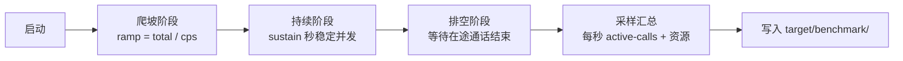
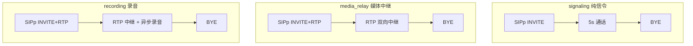

# benchmark — vos-rs 并发基准测试工具

> **vos-rs 的持续并发压测工具** — 区分纯信令、RTP 中继和录音三种成本模型

## 这是什么？

`benchmark/` 是 vos-rs 项目的 **并发基准测试工具**。它通过编排 SIPp 和 Python RTP 发送器，对 `sip-edge` 进行持续并发压测，区分三种成本模型：

- **纯信令**：仅 INVITE/BYE，验证信令面 CPS 上限
- **媒体中继**：携带 RTP 流量，验证媒体面并发上限
- **录音**：在媒体基础上开启录音，验证 I/O 压力下的稳定性

工具会拒绝不能满足 `--sustain` 持续时间的参数组合，并通过 `/manage/active-calls` 实时采集活动通话数（不依赖 SIPp 的 `-l` 推测峰值）。

## 模块结构

```
tools/benchmark/
├── bench.py               # 主入口脚本（编排 SIPp/RTP 发送器）
├── scenarios/             # 基准场景配置（YAML）
└── README.md              # 本文件
```

每次运行产物写入 `target/benchmark/<run-id>/`：

| 文件 | 说明 |
| :--- | :--- |
| `metadata.json` | 中文字段的系统、Git 提交和配置哈希 |
| `results.jsonl` | 所有场景的中文机器可读结果 |
| `summary.csv` | 中文表头的场景汇总 |
| `<scenario>/samples.csv` | 中文表头的每秒资源与通话采样 |
| `<scenario>/result.json` / `report.md` | 完整中文结果和报告 |
| 子进程原始日志 | 保留协议及程序原始输出，便于故障诊断 |

## 架构图

### 并发模型示意图



### 三种场景成本对比



## 并发模型

```text
ramp_seconds = total / cps
sustained_seconds = duration - ramp_seconds
```

工具拒绝不能满足 `--sustain` 的参数组合。活动通话数每秒从
`/manage/active-calls` 采集，不使用 SIPp 的 `-l` 推测实际峰值。

## 场景

| 场景 | RTP 流量 | 录音 |
|---|---:|---:|
| `signaling` | 否 | 否 |
| `media_relay` | 是 | 否 |
| `recording` | 是 | 是 |

测试 YAML 禁止 Redis/PostgreSQL 动态覆盖，确保场景开关不受生产配置影响。
合成呼叫使用独立的 `benchmark` 身份，避免复用真实客户账号。

## 快速开始

```bash
make build-release
python3 tools/benchmark/bench.py --scenario signaling --total 50 --cps 10 --duration 15 --sustain 10
```

标准测试：

```bash
python3 tools/benchmark/bench.py --scenario all --total 500 --cps 100 --duration 35 --sustain 30
```

只检查参数和生成的子进程命令：

```bash
python3 tools/benchmark/bench.py --scenario all --dry-run
```

### 常用参数

| 参数 | 说明 |
| :--- | :--- |
| `--scenario` | 场景名：`signaling` / `media_relay` / `recording` / `all` |
| `--total` | 总呼叫数 |
| `--cps` | 每秒发起呼叫数（爬坡速率） |
| `--duration` | 总测试时长（秒），含爬坡 + 持续 |
| `--sustain` | 期望的持续稳定并发秒数（校验用） |
| `--dry-run` | 仅打印子进程命令，不实际执行 |

## 输出

每次运行写入 `target/benchmark/<run-id>/`：

- `metadata.json`：中文字段的系统、Git 提交和配置哈希；
- `results.jsonl`：所有场景的中文机器可读结果；
- `summary.csv`：中文表头的场景汇总；
- `<scenario>/samples.csv`：中文表头的每秒资源与通话采样；
- `<scenario>/result.json`、`report.md`：完整中文结果和报告；
- 子进程原始日志保留协议及程序原始输出，便于故障诊断。

## 前置条件

- release 模式 `sip-edge`；
- SIPp；
- PostgreSQL 和 Redis；
- 测试配置使用的 UDP/HTTP 端口空闲。

工具只终止自己启动的进程组，不使用 `pkill`。合成呼叫固定使用
`benchmark` 主叫和非数字被叫，避免匹配生产费率前缀后被低余额账户中断。

## 相关文档

- 性能压测报告：[../../docs/development/PERFORMANCE_BENCHMARK.md](../../docs/development/PERFORMANCE_BENCHMARK.md)
- SIPp 业务场景：[../../docs/development/SIPP_BUSINESS_SCENARIOS.md](../../docs/development/SIPP_BUSINESS_SCENARIOS.md)
- 测试工具总览：[../README.md](../README.md)
- 内核调优：[../../docs/deployment/OS_KERNEL_TUNING.md](../../docs/deployment/OS_KERNEL_TUNING.md)
